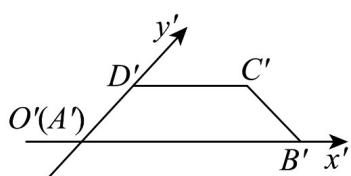

<!-- question-source:start -->
1．如图，四边形ABCD的斜二测画法直观图为等腰梯形 $A^{\prime}B^{\prime}C^{\prime}D^{\prime}$ ．已知 $A^{\prime}D^{\prime}=\sqrt{2}$ ， $C^{\prime}D^{\prime}=2$ ，则下列说法正

确的是（）

A. $AB = 2$

B. $AD = 2\sqrt{2}$

C．四边形ABCD的周长为 $6+2\sqrt{2}+2\sqrt{3}$ D．四边形ABCD的面积为 $6\sqrt{2}$
<!-- question-source:end -->

![[高中/课堂同步/题库/人教A版高中数学同步讲义(2026)/02_必修第二册/第八章 立体几何初步/专题8.2 立体图形的直观图（高效培优讲义）/强化训练/questions/answers/Q00069974A1.md]]
