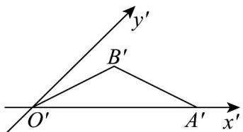

<!-- question-source:start -->
7. 如图， $\triangle O^{\prime}A^{\prime}B^{\prime}$ 是由斜二测画法得到的水平放置的 $\triangle OAB$ 的直观图，其中 $O^{\prime}B^{\prime} = A^{\prime}B^{\prime} = \frac{\sqrt{3}}{3} O^{\prime}A^{\prime} = 2$ ，那么

原平面图形中，OA 边上的高为（）

A. $2\sqrt{3}$ B. $4\sqrt{3}$ C. $2\sqrt{2}$ D. $4\sqrt{2}$
<!-- question-source:end -->

![[高中/课堂同步/题库/人教A版高中数学同步讲义(2026)/02_必修第二册/第八章 立体几何初步/专题8.2 立体图形的直观图（高效培优讲义）/强化训练/questions/answers/Q00069979A1.md]]
