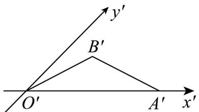

<!-- question-source:start -->
9. 由斜二测画法得到的一个水平放置的三角形的直观图是等腰三角形，底角为 $30^{\circ}$ ，腰长为 $2$ ，如图，那么

它在原平面图形中，顶点 $B$ 到 $x$ 轴的距离是（）

A. $2\sqrt{2}$ B. 2 C. $\sqrt{2}$ D. $\frac{\sqrt{2}}{2}$
<!-- question-source:end -->

![[高中/课堂同步/题库/人教A版高中数学同步讲义(2026)/02_必修第二册/第八章 立体几何初步/专题8.2 立体图形的直观图（高效培优讲义）/强化训练/questions/answers/Q00069981A1.md]]
