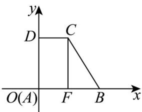

> [!faq]- 《专题8.2 立体图形的直观图（高效培优讲义）》官方解析
>
> > [!success]- **【答案】** BCD
>
> > [!note]- **【分析】**
> > 斜二测画法对应的平行关系、长度关系还原平面图，然后逐一验算各个选项即可得解
>
> > [!note]- **【解析】**
> > 对于 AB：还原平面图如下图，
> >
> > 
> >
> > 则 $AB = A'B' = 4$ ， $CD = C'D' = 2$ ， $AD = 2A'D' = 2\sqrt{2}$ ，故A错误，B正确；
> >
> > 对于 C：过 C 作 $CF \perp AB$ 交 AB 于点 F，则 AF = DC = 2，
> >
> > 由勾股定理得， $CB = \sqrt{2^2 + (2\sqrt{2})^2} = 2\sqrt{3}$
> >
> > 故四边形 $ABCD$ 的周长为： $4 + 2 + 2\sqrt{2} + 2\sqrt{3} = 6 + 2\sqrt{2} + 2\sqrt{3}$ ，即 $C$ 正确；
> >
> > 对于 D：四边形 ABCD 的面积为： $\frac{1}{2}\times(4+2)\times2\sqrt{2}=6\sqrt{2}$ ，即 D 正确.
> >
> > 故选 **BCD**.
