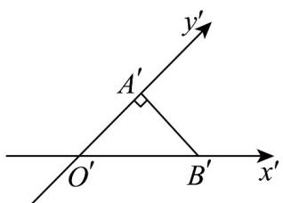
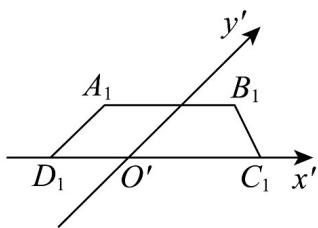

> [!faq]- 《专题8.2 立体图形的直观图（高效培优讲义）》官方解析
>
> > [!success]- **【答案】**  A. $2\sqrt{2}$ B. $2\sqrt{3}$ C. 1 D. 2
>
> > [!note]- **【分析】**
> > 结合题意由斜二测画法长度的计算可得·
>
> > [!note]- **【解析】**
> > 设 $O'A'=x$
> >
> > 由题意可得 $\frac{1}{2} x^2 = 1$ ，则 $x = \sqrt{2}$
> >
> > 所以 $O'B' = \sqrt{2 + 2} = 2$
> >
> > 所以在VAOB中， $OA = 2O'A' = 2\sqrt{2},OB = O'B' = 2$
> >
> > 由 $OA \perp OB$ ，所以 $AB = \sqrt{8 + 4} = 2\sqrt{3}$ ，即VAOB中最长的边长为 $2\sqrt{3}$ 。
> >
> > 故选：B
> >
> > 6. 如下图所示, 梯形 $A_{1}B_{1}C_{1}D_{1}$ 是水平放置的平面图形 $ABCD$ 的直观图(斜二测画法), 若 $A_{1}D_{1} // O_{1}y'$ , $A_{1}B_{1} // C_{1}D_{1}$ .
> >
> > $A_{1}B_{1}=\frac{2}{3}C_{1}D_{1}=2$ ， $A_{1}D_{1}=1$ ，则四边形ABCD的面积是\_\_\_\_。
> >
> > 
> >
> > 【答案】5
> >
> > 【分析】根据斜二测画法知，四边形 ABCD 是上底为 2 下底为 3，高 $A_{1}D_{1}=2$ 的直角梯形，利用梯形公式即可
> >
> > 求解·
> >
> > 【详解】由直观图知，四边形 ABCD 中，AB // CD, AB = 2, CD = 3，因为 $A_{1}D_{1} // O_{1}y'$ ，所以 $AD \perp CD$ ，且 AD = 2，
> > 根据梯形面积公式 $s=\frac{1}{2}\times(2+3)\times2=5$ ，故填 $^{5}$ .
