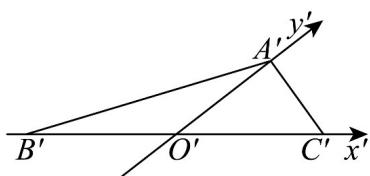
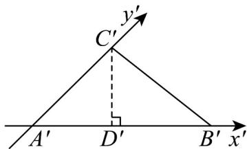

> [!faq]- 《专题8.2 立体图形的直观图（高效培优讲义）》官方解析
>
> > [!success]- **【答案】** A. $2\sqrt{2}$ B. $\sqrt{2}$ C. $\sqrt{5-2\sqrt{2}}$ D. $\sqrt{\frac{5}{4}-\frac{\sqrt{2}}{2}}$
>
> > [!note]- **【分析】**
> > 根据题意，分别以 BC 所在的直线为 x 轴，以 AB 所在的直线为 x 轴，以 BC 所在的直线为 y 轴，建立平面直角坐标系，画出直观图，求得 $B^{\prime}C^{\prime}$ 的长（范围），结合选项，即可求解
>
> > [!note]- **【解析】**
> > 以 BC 所在的直线为 $x^{\prime}$ 轴，画出 VABC 的直观图，如图所示，
> >
> > 因为 VABC 为等腰直角三角形，且 AB = AC = 1，可得 $BC = \sqrt{2}$ ，
> >
> > 此时 $\triangle A^{\prime}B^{\prime}C^{\prime}$ 中，可得 $B^{\prime}C^{\prime} = BC = \sqrt{2}$ ，所以 B 正确；
> >
> > 
> >
> > 以 $AB$ 所在的直线为 $x'$ 轴，以 $AC$ 所在的直线为 $y'$ 轴，如图所示，
> >
> > 可得 $A^{\prime}B^{\prime}=1, A^{\prime}C^{\prime}=\frac{1}{2}$ ，且 $\angle B^{\prime}A^{\prime}C^{\prime}=45^{\circ}$ ，
> >
> > 过 $C'$ 作 $C'D' \perp x'$ 轴于点 $D\Phi$ ，可得 $A'D' = C'D' = \frac{\sqrt{2}}{4}$ ，则 $B'D' = 1 - \frac{\sqrt{2}}{4}$
> >
> > 在直角 $VB^{\prime}C^{\prime}D^{\prime}$ 中，可得 $B^{\prime}C^{\prime}=\sqrt{(1-\frac{\sqrt{2}}{4})^{2}+(\frac{\sqrt{2}}{4})^{2}}=\sqrt{\frac{5}{4}-\frac{\sqrt{2}}{2}}$ ，故D正确；
> >
> > 
> >
> > 以 B 为坐标原点，以 BC 所在的直线为 $y'$ 轴，此时 $B'C' = \frac{1}{2} BC = \frac{\sqrt{2}}{2}$ ，
> >
> > 所以 $B^{\prime}C^{\prime}$ 得取值范围为 $\left[\frac{\sqrt{2}}{2},\sqrt{2}\right]$ ，结合选项，可得 $^{\mathrm{B}}$ 、 $^{\mathrm{D}}$ 正确·
> >
> > 故选 **BD**.
