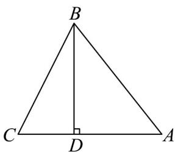

<!-- question-source:start -->
【变式2】如图所示，在VABC中， $AC = 12\mathrm{cm}$ ， $AC$ 边上的高 $BD = 12\mathrm{cm}$

(1)画出水平放置的VABC的直观图；

(2)求直观图的面积.
<!-- question-source:end -->

![[高中/课堂同步/题库/人教A版高中数学同步讲义(2026)/02_必修第二册/第八章 立体几何初步/专题8.2 立体图形的直观图（高效培优讲义）/题型01_水平放置的平面图形直观图的画法/questions/answers/Q00069966A1.md]]
