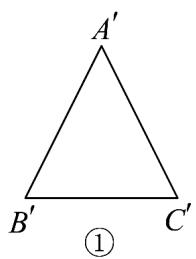
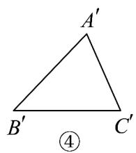

<!-- question-source:start -->
【变式3】如图，已知等腰三角形 $ABC$ ，则如图所示①②③④的四个图中，可能是VABC的直观图的有

( )

A. 1个

B. 2个

C. 3个

D. 4个
<!-- question-source:end -->

![[高中/课堂同步/题库/人教A版高中数学同步讲义(2026)/02_必修第二册/第八章 立体几何初步/专题8.2 立体图形的直观图（高效培优讲义）/题型01_水平放置的平面图形直观图的画法/questions/answers/Q00069967A1.md]]
