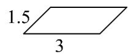
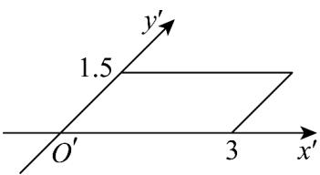

> [!faq]- 《专题8.2 立体图形的直观图（高效培优讲义）》官方解析
>
> > [!success]- **【答案】** 3 A  3 B 1.5  3 C  D 
>
> > [!note]- **【分析】**
> > 利用斜二测画法作出直观图，可得结果·
>
> > [!note]- **【解析】**
> > 作出正方形的斜二测直观图如下图所示（单位：cm）：
> >
> > 
> >
> > 故选 **C**.
