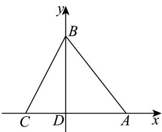

> [!faq]- 《专题8.2 立体图形的直观图（高效培优讲义）》官方解析
>
> > [!success]- **【答案】** (1)作图见解析 (2) $18\sqrt{2}\left(\mathrm{cm}^{2}\right)$
>
> > [!note]- **【分析】**
> > （ $^{1}$ ）利用斜二测画法画出直观图即可；
> >
> > (2) 作 $B'E \perp A'C'$ ， $E$ 为垂足，求出 $B'E = 3\sqrt{2}$ 即可求解。
>
> > [!note]- **【解析】**
> > （1）①以 $D$ 为原点， $AC$ 所在直线为 $x$ 轴， $DB$ 所在直线为 $y$ 轴建立平面直角坐标系，如图①
> >
> > 
> > - **①**：
> > - **②**：
> > - **②**：画出对应的 $x'$ ， $y'$ 轴，使 $\angle x'D'y'=45^{\circ}$ ，
> >
> > 在 $x'$ 轴上取点 $A'$ ， $C'$ ，使 $D'A'=DA$ ， $D'C'=DC$
> >
> > 在 $y'$ 轴上取点 $B'$ ，使 $D'B' = \frac{1}{2} DB$
> >
> > 连接 $A'B'$ ， $C'B'$ ，则 $\triangle A'B'C'$ 即为 VABC 的直观图，如图②。
> >
> > (2) 在图②中，作 $B^{\prime}E \perp A^{\prime}C^{\prime}$ ， $E$ 为垂足，
> >
> > $$
> > \because D ^ {\prime} B ^ {\prime} = \frac {1}{2} D B = 6 (\mathrm{cm}), \angle B ^ {\prime} D ^ {\prime} E = 4 5 ^ {\circ}, \therefore B ^ {\prime} E = 6 \times \frac {\sqrt {2}}{2} = 3 \sqrt {2}
> > $$
> >
> > $$
> > \therefore S _ {\triangle A ^ {\prime} B ^ {\prime} C ^ {\prime}} = \frac {1}{2} \times A ^ {\prime} C ^ {\prime} \times B ^ {\prime} E = \frac {1}{2} \times 1 2 \times 3 \sqrt {2} = 1 8 \sqrt {2} (\mathrm{cm} ^ {2}).
> > $$
