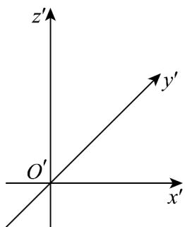

<!-- question-source:start -->
【变式3】已知直三棱柱 $ABC - A_{1}B_{1}C_{1}$ ，的底面是等腰直角三角形，且 $AB = AC = 4$ ，侧棱 $AA_{1} = 5$ 。在给定

的坐标系中，用斜二测画法画出该三棱柱的直观图．（不要求写出画法，但要标上字母，并保留作图痕迹）

<!-- question-source:end -->

![[高中/课堂同步/题库/人教A版高中数学同步讲义(2026)/02_必修第二册/第八章 立体几何初步/专题8.2 立体图形的直观图（高效培优讲义）/题型02_几何体的直观图画法/questions/answers/Q00069970A1.md]]
