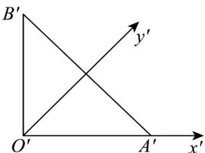

<!-- question-source:start -->
【变式3】如图，用斜二测画法画出的水平放置的VAOB的直观图是 $\mathrm{Rt}\triangle A'O'B'$ ，若 $A'B'$ 的中点在 $y'$ 轴上，

且 $O^{\prime}A^{\prime} = O^{\prime}B^{\prime} = \sqrt{2}$ ，则 $AB = (\quad)$

A. $2\sqrt{6}$ B.4 C. $2\sqrt{3}$ D.2
<!-- question-source:end -->

![[高中/课堂同步/题库/人教A版高中数学同步讲义(2026)/02_必修第二册/第八章 立体几何初步/专题8.2 立体图形的直观图（高效培优讲义）/题型03_与直观图还原有关的计算问题/questions/answers/Q00069973A1.md]]
