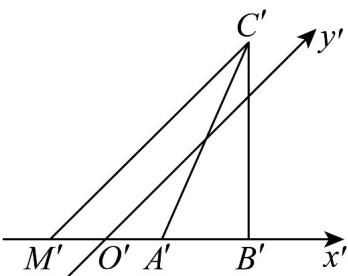

> [!faq]- 《专题8.2 立体图形的直观图（高效培优讲义）》官方解析
>
> > [!success]- **【答案】** D
>
> > [!note]- **【分析】**
> > 过 $C'$ 作 $C'M' // y'$ 轴，交 $x'$ 轴于 $M'$ ，求出 $C'M'$ 的长，由斜二测画法的规则可知， $CM = 2C'M'$ 即为
> > VABC 的边 AB 上的高.
>
> > [!note]- **【解析】**
> > 如图，过 $C'$ 作 $C'M'//y'$ 轴，交 $x'$ 轴于 $M'$ ，
> >
> > 在 $\triangle C^{\prime}M^{\prime}B^{\prime}$ 中，因为 $B^{\prime}C^{\prime}$ 与 $x^{\prime}$ 轴垂直，且 $B^{\prime}C^{\prime} = 2\sqrt{2}$ ， $\angle C^{\prime}M^{\prime}B^{\prime} = 45^{\circ}$
> >
> > 所以 $C'M'=\frac{B'C'}{\sin45^{\circ}}=\frac{2\sqrt{2}}{\frac{\sqrt{2}}{2}}=4$
> >
> > 由斜二测画法知： $CM = 2C'M' = 8$ ，所以 VABC 的边 AB 上的高为 8. 故选：D.
> >
> > 
