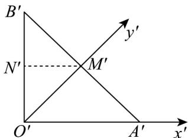
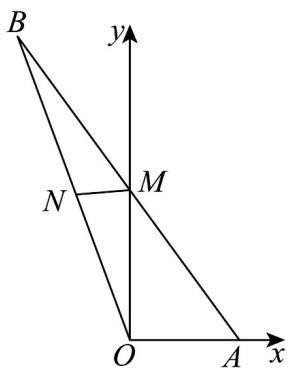

> [!faq]- 《专题8.2 立体图形的直观图（高效培优讲义）》官方解析
>
> > [!success]- **【答案】** A
>
> > [!note]- **【分析】**
> > 作 $M^{\prime}N^{\prime} / O^{\prime}A^{\prime}$ ，求得 $O^{\prime}M^{\prime} = 1$ ，然后作出原来图形，求得 $AM$ ， $M$ 为 $AB$ 的中点，最后判断即可·
>
> > [!note]- **【解析】**
> > 由题可知： $M'$ 为 $A'B'$ 的中点， $O'A'=O'B'=\sqrt{2}$ ，则 $O'M'=1$ ，作 $M'N'/O'A'$ ， $M'N'=\frac{\sqrt{2}}{2}$ 如图：
> >
> > 
> >
> > 作出原来图形：
> >
> > 
> >
> > 所以 $OA = \sqrt{2}, OM = 2, MN = \frac{\sqrt{2}}{2}$ ，由 $OA \perp OM$ ，所以 $AM = \sqrt{6}$
> >
> > 又 M 为 AB 的中点，所以 $AB = 2\sqrt{6}$ .
> >
> > 故选 **A**
