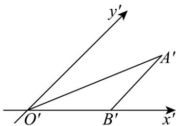
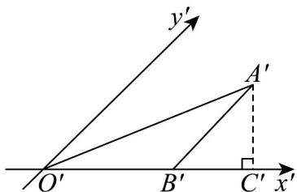

## 题型03 与直观图还原有关的计算问题

【典例1】如图所示， $\triangle A'B'O'$ 是利用斜二测画法画出的 $\triangle ABO$ 的直观图，已知 $A'B' // y'$ 轴， $O'B' = 4$ ，且 $\triangle ABO$ 的面积为 $^{16}$ ，那么 $\triangle A'B'O'$ 的面积为 \_\_\_\_。

【答案】 $4\sqrt{2}$

【分析】利用面积公式，求出直观图的高，求出 $A'B'$ ，然后求出 $A'C'$ 的长，即可得出三角形面积·

【详解】因为 $A^{\prime}B^{\prime}//y^{\prime}$ 轴，所以 $\triangle ABO$ 的中， $AB \perp OB$

又三角形的面积为 $^{16}$ ，所以 $\frac{1}{2}AB\cdot OB=16$ $\therefore AB=8$

所以 $A'B'=4$

如图作 $A^{\prime}C^{\prime}\perp O^{\prime}B^{\prime}$ 于 $C^{\prime}$

因为 $\angle A^{\prime}B^{\prime}C^{\prime}=45^{\circ}$ ，所以 $A^{\prime}C^{\prime}=4\sin45^{\circ}=2\sqrt{2}$

所以 $S_{\triangle A^{\prime}B^{\prime}C^{\prime}}=\frac{1}{2}B^{\prime}O^{\prime}\cdot A^{\prime}C^{\prime}=\frac{1}{2}\times4\times2\sqrt{2}=4\sqrt{2}$

故答案为： $4\sqrt{2}$

## 方法技巧

直观图还原注意事项

由于斜二测画法中平行于 $x$ 轴的线段的长度在直观图中长度不变，而平行于 $y$ 轴的线段在直观图中长度要减

半，同时要倾斜 $45^{\circ}$ ，因此平面多边形的直观图中的计算需注意两点。

(1) 直观图中任何一点距 $x'$ 轴的距离都为原图形中相应点距 $x$ 轴距离的 $\sin 45^{\circ} =$ 倍.

(2) $S_{\text{直观图}} = S_{\text{原图}}$

由直观图计算原图形中的量时，注意上述两个结论的转换。

![[高中/课堂同步/题库/人教A版高中数学同步讲义(2026)/02_必修第二册/第八章 立体几何初步/专题8.2 立体图形的直观图（高效培优讲义）/题型03_与直观图还原有关的计算问题/questions/Q00069971.md]]
![[高中/课堂同步/题库/人教A版高中数学同步讲义(2026)/02_必修第二册/第八章 立体几何初步/专题8.2 立体图形的直观图（高效培优讲义）/题型03_与直观图还原有关的计算问题/questions/Q00069972.md]]
![[高中/课堂同步/题库/人教A版高中数学同步讲义(2026)/02_必修第二册/第八章 立体几何初步/专题8.2 立体图形的直观图（高效培优讲义）/题型03_与直观图还原有关的计算问题/questions/Q00069973.md]]
