<!-- source-part:1 pages:1-50 -->

## 专题8.3 简单几何体的表面积与体积

## 内容概览

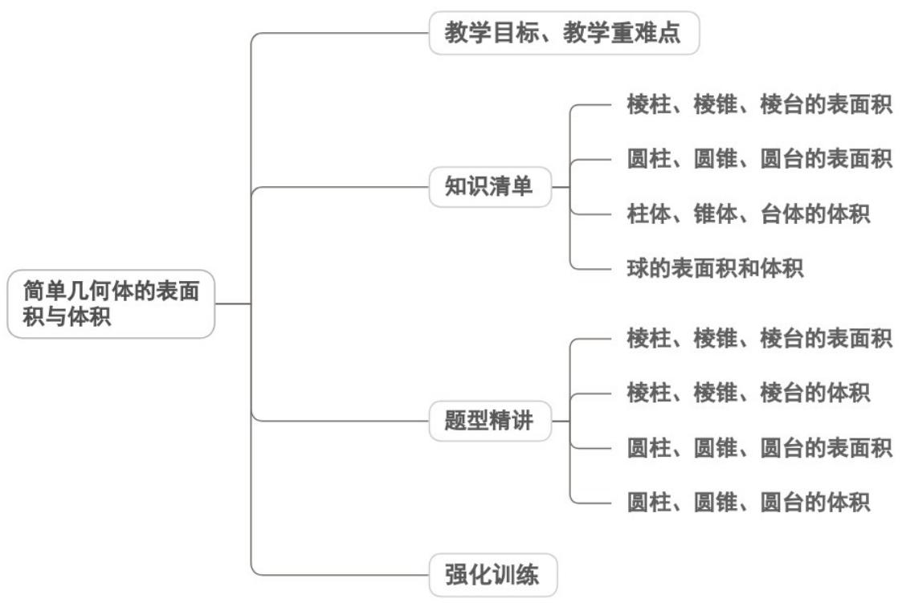

教学目标、教学重难点

<table><tr><td>教学目标</td><td>1.掌握棱柱、棱锥、棱台(多面体)及圆柱、圆锥、圆台、球(旋转体)的表面积与体积计算公式,明确各公式的适用条件与核心参数(如底面边长、半径、高、母线长等)。2.能准确识别简单几何体的结构特征,熟练运用公式求解单一几何体的表面积与体积,能处理与几何体相关的组合体(如拼接、截割形成的图形)的度量问题。3.会解决球的切、接问题(如几何体的外接球、内切球相关计算),能运用体积与表面积公式解决工业零件、建筑构件等实际场景中的度量问题。</td></tr><tr><td>教学重难点</td><td>1.重点基础计算的准确性:能根据几何体的已知条件(如底面半径、高、母线长)快速代入公式计算,解决无复杂转化的直接度量问题。2.难点球的切、接问题:确定球心位置与半径,建立几何体棱长与球半径的数量关系(如长方体的外接球直径等于体对角线),解决含隐含条件的复杂问题。</td></tr></table>

## 知识清单

## 知识点 01 棱柱、棱锥、棱台的表面积

棱柱、棱锥、棱台是多面体，它们的各个面均是平面多边形，它们的表面积就是各个面的面积之和．计算时

要分清面的形状，准确算出每个面的面积再求和．棱柱、棱锥、棱台底面与侧面的形状如下表：

<table><tr><td>项目名称</td><td>底面</td><td colspan="2">侧面</td></tr><tr><td>棱柱</td><td>平面多边形</td><td>平行四边形</td><td>面积=底·高</td></tr><tr><td>棱锥</td><td>平面多边形</td><td>三角形</td><td> $\frac{1}{2}$ ·底·高</td></tr><tr><td>棱台</td><td>平面多边形</td><td>梯形</td><td> $\frac{1}{2}$ ·(上底+下底)·高</td></tr></table>

知识点诠释：求多面体的表面积时，只需将它们沿着若干条棱剪开后展开成平面图形，利用平面图形求多面

体的表面积.

## 【即学即练】

1. 如图所示，正六棱锥被过棱锥高 $PO$ 的中点 $O'$ 且平行于底面的平面所截，得到正六棱台 $OO'$ 和较小的棱锥

PO'

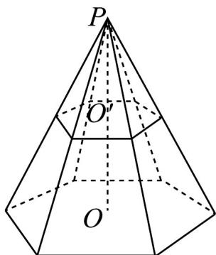

(1)求大棱锥，小棱锥，棱台的侧面面积之比；

(2)若大棱锥 $PO$ 的侧棱长为 $12\mathrm{cm}$ ，小棱锥的底面边长为 $4\mathrm{cm}$ ，求截得的棱台的侧面面积和表面积

【答案】(1)4:1:3

(2)侧面积 $144\sqrt{2}cm^{2}$ ; 表面积 $\left(120\sqrt{3}+144\sqrt{2}\right)\mathrm{cm}^{2}$ .

【分析】（1）设小棱锥的底面边长为 $a$ ，斜高为 $h$ ，从而可得出大棱锥的底面边长和斜高，然后可分别求出

大棱锥，小棱锥，棱台的侧面积，从而可求出大棱锥，小棱锥，棱台的侧面积之比；

(2) 根据条件可求出大棱锥的底面边长和斜高，从而可求出大棱锥的侧面积；根据 (1) 的结论可求出棱台

的侧面积；再求出棱台的上下底面的面积，从而可求出棱台的表面积·

【详解】（1）设小棱锥的底面边长为 $a$ ，斜高为 $h$ ，则大棱锥的底面边长为 $2a$ ，斜高为 $2h$

所以大棱锥的侧面积为 $6 \times \frac{1}{2} \times 2a \times 2h = 12ah$ ，小棱锥的侧面积为 $6 \times \frac{1}{2} \times a \times h = 3ah$ ，

棱台的侧面积为 12ah - 3ah = 9ah

所以大棱锥，小棱锥，棱台的侧面积之比 $12ah:3ah:9ah=4:1:3$ .

(2) 因为小棱锥的底面边长为 $4 \, cm$ ，所以大棱锥的底面边长为 $8 \, cm$ ，

因为大棱锥的侧棱长为 $12\mathrm{cm}$ ，所以大棱锥的斜高为 $\sqrt{144 - 16} = 8\sqrt{2}\mathrm{cm}$ ，

所以大棱锥的侧面积为 $6 \times \frac{1}{2} \times 8 \times 8\sqrt{2} = 192\sqrt{2}\mathrm{cm}^2$

所以棱台的侧面积为 $192\sqrt{2} \times \frac{3}{4} = 144\sqrt{2}\mathrm{cm}^2$

棱台的上，下底面的面积和为 $6 \times \frac{\sqrt{3}}{4} \times 4^{2} + 6 \times \frac{\sqrt{3}}{4} \times 8^{2} = 24\sqrt{3} + 96\sqrt{3} = 120\sqrt{3}\mathrm{cm}^{2}$

所以棱台的表面积为 $\left(120\sqrt{3}+144\sqrt{2}\right)\mathrm{cm}^{2}$

2. “阿基米德多面体”又称“半正多面体”，与正多面体类似，它们都是凸多面体，每个面都是正多边形，并且

所有棱长也都相等，但不同之处在于阿基米德多面体的每个面的形状不全相同．某些阿基米德多面体可由正

多面体进行“截角”得到．如图，正四面体的棱长为 $^{6}$ ，取各条棱的三等分点，从各棱的三等分点处截去四个角

后可得到一个阿基米德多面体，则该多面体的表面积为\_\_\_\_。

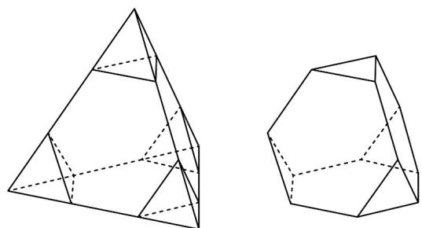

【答案】 $28 \sqrt{3}$

【分析】该多面体的棱长为 $^{2}$ ，且表面由四个正三角形和四个正六边形组成，结合表面积公式进行计算即可

求解·

【详解】正四面体的棱长为 $^{6}$ ，从各棱的三等分点处截得多面体，

则该多面体的棱长为 $^{2}$ ，且表面由四个正三角形和四个正六边形组成，

故该多面体的表面积为 $4 \times \frac{1}{2} \times 2 \times \sqrt{3} + 4 \times 6 \times \frac{1}{2} \times 2 \times \sqrt{3} = 28\sqrt{3}$

故答案为： $28 \sqrt{3}$

## 知识点 02 圆柱、圆锥、圆台的表面积

圆柱、圆锥、圆台是旋转体，它们的底面是圆面，易求面积，而它们的侧面是曲面，应把它们的侧面展开为

平面图形，再去求其面积。

## 1、圆柱的表面积

（1）圆柱的侧面积：圆柱的侧面展开图是一个矩形，如下图，圆柱的底面半径为 $r$ ，母线长 $l$ ，那么这个矩

形的长等于圆柱底面周长 $C = 2\pi r$ ，宽等于圆柱侧面的母线长 $l$ （也是高），由此可得 $S_{\text{圆柱侧}} = C^l = \underline{2\pi r} l$

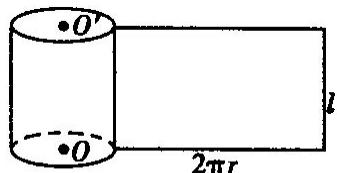

(2) 圆柱的表面积： $S_{圆柱表} = 2\pi r^{2} + 2\pi rl = 2\pi r(r + l)$

2、圆锥的表面积

(1) 圆锥的侧面积：如下图（1）所示，圆锥的侧面展开图是一个扇形，如果圆锥的底面半径为 $r$ ，母线长

为 $l$ ，那么这个扇形的弧长等于圆锥底面周长 $C = \pi r$ ，半径等于圆锥侧面的母线长为 $l$ ，由此可得它的侧面积

是 $S_{\text{圆锥侧}} = \frac{1}{2} Cl = \pi rl$

(2) 圆锥的表面积：S 圆锥表 = $\pi r^{2} + \pi rl$

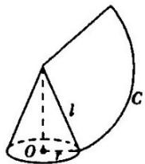

(1)

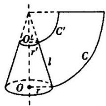

(2)

3、圆台的表面积

(1) 圆台的侧面积：如上图（2）所示，圆台的侧面展开图是一个扇环。如果圆台的上、下底面半径分别为

$r'$ 、r，母线长为 l，那么这个扇形的面积为 $\pi(r'+r)l$ ，即圆台的侧面积为 $S_{\text{圆台侧}}=\pi(r'+r)l$

(2) 圆台的表面积： $S_{圆台表} = \pi(r'^{2} + r^{2} + r'l + rl)$

知识点诠释：求旋转体的表面积时，可从旋转体的生成过程及其几何特征入手，将其展开后求表面积，但要

搞清它们的底面半径、母线长与对应的侧面展开图中的边长之间的关系.

【即学即练】

1. 实心圆锥 $PO$ 的底面直径为 6，高为 4，过 $PO$ 中点 $O'$ 作平行于底面的截面，以该截面为底面挖去一个圆柱，

则剩下几何体的表面积为（）

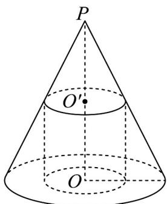

A 27.75π B 30π C 32.25π D 34.5π

【答案】B

【分析】求出挖去的圆柱底面半径和高，再结合圆锥表面积、圆柱侧面积公式直接计算可得结果

【详解】根据题意 $PO$ 的中点为 $O'$ 可知，挖去的圆柱底面半径为 $\frac{3}{2}$ ，高为 $2$ ，

剩下几何体的表面积为圆锥表面积加上挖去圆柱的侧面积，显然圆锥母线为 $\sqrt{3^2 + 4^2} = 5$

易知圆锥表面积为 $\pi \times 3^{2} + \pi \times 3\times 5 = 24\pi$ ，圆柱侧面积为 $2\pi \times \frac{3}{2}\times 2 = 6\pi$

所以剩下几何体的表面积为 $24\pi + 6\pi = 30\pi$ · 故选：B

2. 已知半径为 $^{2}$ 的球O与某圆锥的底面和侧面均相切，且该圆锥的轴截面为等边三角形，则该圆锥的表面积

为（ ）A. $24\pi$ B. $36\pi$ C. $18\pi$ D. $30\pi$

【答案】B

【分析】根据圆锥的特征、边角关系求出圆锥底面半径和母线的长，进而根据圆锥的表面积公式求出圆锥的

表面积·

【详解】如图， $\triangle SAB$ 是该圆锥的轴截面， $H$ 为线段 $AB$ 的中点， $O$ 为球 $O$ 的球心，

作 $OC \perp BS$ ，垂足为 $C$ ，则 $\sin \angle OSC = \frac{OC}{OS} = \frac{BH}{BS}$

因为 $\triangle SAB$ 为等边三角形，所以 $BS = 2BH$ ，所以 $\frac{OC}{OS} = \frac{BH}{BS} = \frac{1}{2}$

所以 $OS = 2OC = 4$ ，所以 $SH = 6$ ，所以 $BS = 2BH = 4\sqrt{3}$

那么该圆锥的表面积为 $\pi\cdot(2\sqrt{3})^{2}+\frac{1}{2}\times4\sqrt{3}\pi\times4\sqrt{3}=36\pi$ 故选：B.

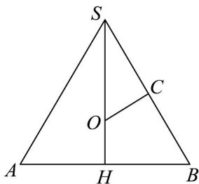

知识点 03 柱体、锥体、台体的体积

1、柱体的体积公式

棱柱的体积：棱柱的体积等于它的底面积 S 和高 h 的乘积，即 $V_{棱柱} = \underline{Sh}$ .

圆柱的体积：底面半径是 r，高是 h 的圆柱的体积是 $V_{圆柱}=Sh=\pi r^{2}h$ .

综上，柱体的体积公式为 $V = Sh$ ：

2、锥体的体积公式

棱锥的体积：如果任意棱锥的底面积是 $S$ ，高是 $\pmb{h}$ ，那么它的体积 $V_{\text{棱锥}} = \frac{1}{3} Sh$

圆锥的体积：如果圆锥的底面积是 $S$ ，高是 $h$ ，那么它的体积 $V_{\text{圆锥}} = \frac{1}{3} Sh$ ；如果底面积半径是 $r$ ，用 $\pi r^2$ 表示

$V_{\text{圆锥}} = \frac{1}{3}\pi r^2 h$ $S$ ，则

综上，锥体的体积公式为 $V = \frac{1}{3} Sh$

## 3、台体的体积公式

棱台的体积：如果棱台的上、下底面的面积分别为 $S'$ 、 $S$ ，高是 $h$ ，那么它的体积是

$$
V _ {\mathrm{棱台}} = \frac {1}{3} h (S + \sqrt {S S ^ {\prime}} + S ^ {\prime})
$$

圆台的体积：如果圆台的上、下底面半径分别是 $r'$ 、 $r$ ，高是 $h$ ，那么它的体积是

$$
V _ {\text {圆台}} = \frac {1}{3} h (S + \sqrt {S S ^ {\prime}} + S ^ {\prime}) = \frac {1}{3} \pi h (r ^ {2} + r r ^ {\prime} + r ^ {\prime 2})
$$

综上，台体的体积公式为 $V=\frac{1}{3}h(S+\sqrt{SS'}+S')$

【即学即练】

1. 在VABC中，AC=3，BC=4，AB=5。以AB所在的直线为轴旋转一周，求所围成的几何体的体积\_\_\_\_

【答案】 $\frac{48}{5}\pi$

【分析】由题意可知，围成几何体是两个同底的圆锥，然后结合圆锥的体积公式代入计算，即可得到结果

【详解】因为 $AC^2 + BC^2 = AB^2$ ，所以 $\angle ACB = 90^\circ$ ， $AB$ 为直角三角形的斜边，

以 $AB$ 所在的直线为轴旋转一周，所得的几何体为两个同底的圆锥，

圆锥的底面半径为斜边 AB 边上的高，即 $\frac{3 \times 4}{5} = \frac{12}{5}$ ，

所以围成的几何体的体积为 $V=\frac{1}{3}\times AB\times\pi r^{2}=\frac{1}{3}\times5\pi\times\left(\frac{12}{5}\right)^{2}=\frac{48}{5}\pi$ 故答案为： $\frac{48}{5}\pi$

2. 中国古代数学家刘徽在《九章算术注》中，称一个正方体内两个互相垂直的内切圆柱所围成的立体为“牟

合方盖”，但刘徽未能求得牟合方盖的体积，约 $^{200}$ 年后，祖冲之的儿子祖暅提出“幂势既同，则积不容异”，

后世称为祖暅原理，即：两等高立体，若在每一等高处的截面积都相等，则两立体体积相等．图 $^{1}$ 为棱长为r

的正方体截得的“牟合方盖”的八分之一，图 $^{2}$ 为棱长为r的正方体的八分之一，图 $^{3}$ 是底面边长为r的正方体

的一个底面和底面以外的顶点作的正四棱锥，由祖暅原理计算知，牟合方盖的体积与其外切正方体的体积之

比为（ ）

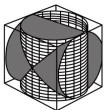

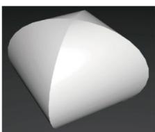

图1
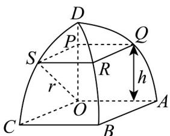

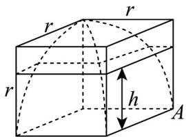
图2

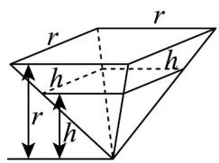
图3

A. $\frac{1}{3}$ B. $\frac{2}{3}$ C. $\frac{3}{16}$ D. $\frac{9}{16}$

【答案】B

【分析】根据题意，列等式，套用正方体，锥体体积公式求解·

【详解】设正方体的边长为 $2r$ ，则 $V_{\text{正方体}} = (2r)^3 = 8r^3$

由 $\frac{1}{8} V_{\text{正方体}} - \frac{1}{8} V_{\text{牟合方盖}} = \frac{1}{3} r^2 \cdot r = \frac{1}{3} \cdot \frac{1}{8} V_{\text{正方体}}$ ，则 $V_{\text{牟合方盖}} = \frac{2}{3} V_{\text{正方体}}$ ，

所以牟合方盖的体积与其外切正方体的体积之比为 $\frac{2}{3}$ 故选：B.

## 知识点 04 球的表面积和体积

## 1、球的表面积

（1）球面不能展开成平面，要用其他方法求它的面积。

(2) 球的表面积

设球的半径为 R，则球的表面积公式 $S_{球}=\underline{4\pi R^{2}}$ .

即球面面积等于它的大圆面积的四倍.

## 2、球的体积

设球的半径为 $R$ ，它的体积只与半径 $R$ 有关，是以 $R$ 为自变量的函数.

球的体积公式为 $V_{球}=\frac{4}{3}\pi R^{3}$

【即学即练】

1．已知直三棱柱 $ABC-A_{1}B_{1}C_{1}$ ， $AB\perp BC$ ，AB=6，BC=8， $AA_{1}=8$ ，设该直三棱柱的外接球的表面积为

【答案】

$S_{1}$ ，该直三棱柱内部半径最大的球的表面积为 $S_{2}$ ，则 $\frac{S_1}{S_2} =$ （）

A. $\frac{13}{2}$ B. $\frac{27}{2}$ C. $\frac{35}{4}$ D. $\frac{41}{4}$

【答案】D

【分析】根据球的性质结合条件可得直三棱柱 $ABC-A_{1}B_{1}C_{1}$ 外接球半径R，然后根据直三棱柱 $ABC-A_{1}B_{1}C_{1}$ 的底面三角形内切圆半径结合条件可得内切球半径r，进而得解。
【详解】由题直三棱柱 $ABC-A_{1}B_{1}C_{1}$ 底面三角形外接圆半径为 $r_{1}=\frac{AC}{2}=\frac{\sqrt{6^{2}+8^{2}}}{2}=5$ ，
内切圆半径为 $r_{2}=\frac{2S_{\triangle ABC}}{AB+BC+AC}=\frac{AB\times BC}{AB+BC+AC}=\frac{6\times8}{6+8+10}=2<\frac{AA_{1}}{2}=4$ ，
所以外接球半径R满足 $R^{2}=5^{2}+4^{2}=41$ ，故 $S_{1}=4\pi R^{2}=164\pi$ ；
内切球半径为 $r=r_{2}=2$ ，故 $S_{2}=4\pi r^{2}=16\pi$ ，
因此 $\frac{S_{1}}{S_{2}}=\frac{164\pi}{16\pi}=\frac{41}{4}$ ·故答案为： $\frac{41}{4}$

$$
P - A B C
$$

$$
A B C
$$

$$
P A = 2 A B = 2 B C = 4
$$

$$
A C = 2 \sqrt {2}
$$

一个球面上，则该球的表面积为（ ）
A. $4\sqrt{6}\pi$ B. $12\pi$ C. $8\sqrt{6}\pi$ D. $24\pi$

【答案】D

【分析】将三棱锥 P-ABC 补成长方体 ABCD-PQMN，计算出长方体 ABCD-PQMN 的体对角线长，即为该三棱锥外接球的直径，再结合球体表面积公式可得结果·

【详解】因为 AB = BC = 2， $AC = 2\sqrt{2}$ ，所以 $AB^{2} + BC^{2} = AC^{2}$ ，故 $AB \perp BC$ ，

又因为 $PA \perp$ 平面 $ABC$ ， $PA = 4$ ，将三棱锥 $P - ABC$ 补成长方体 $ABCD - PQMN$ ，如下图所示：

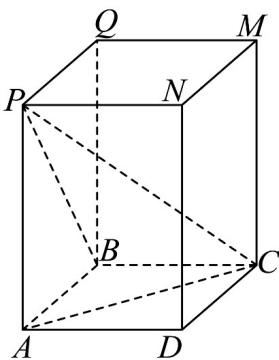

所以三棱锥 $P - ABC$ 的外接球直径即为长方体 $ABCD - PQMN$ 的体对角线长，

设三棱锥 $P - ABC$ 的外接球半径为 $R$ ，则 $2R = \sqrt{PA^2 + AB^2 + BC^2} = \sqrt{4^2 + 2^2 + 2^2} = 2\sqrt{6}$ ，故 $R = \sqrt{6}$

因此该球的表面积为 $4\pi R^{2} = 4\pi \times 6 = 24\pi$ ·故选：D.

## 题型精讲

![[高中/课堂同步/题库/人教A版高中数学同步讲义(2026)/02_必修第二册/第八章 立体几何初步/专题8.3 简单几何体的表面积与体积（高效培优讲义）/题型01_棱柱_棱锥_棱台的表面积/题型01_棱柱_棱锥_棱台的表面积.md]]
![[高中/课堂同步/题库/人教A版高中数学同步讲义(2026)/02_必修第二册/第八章 立体几何初步/专题8.3 简单几何体的表面积与体积（高效培优讲义）/题型02_棱柱_棱锥_棱台的体积/题型02_棱柱_棱锥_棱台的体积.md]]
![[高中/课堂同步/题库/人教A版高中数学同步讲义(2026)/02_必修第二册/第八章 立体几何初步/专题8.3 简单几何体的表面积与体积（高效培优讲义）/题型03_圆柱_圆锥_圆台的表面积/题型03_圆柱_圆锥_圆台的表面积.md]]
![[高中/课堂同步/题库/人教A版高中数学同步讲义(2026)/02_必修第二册/第八章 立体几何初步/专题8.3 简单几何体的表面积与体积（高效培优讲义）/题型04_圆柱_圆锥_圆台的体积/题型04_圆柱_圆锥_圆台的体积.md]]
![[高中/课堂同步/题库/人教A版高中数学同步讲义(2026)/02_必修第二册/第八章 立体几何初步/专题8.3 简单几何体的表面积与体积（高效培优讲义）/强化训练/强化训练.md]]
