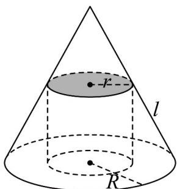

<!-- question-source:start -->
1. 某几何体由圆锥挖去一个圆柱而得，且圆柱的上底面与圆锥内接，如图所示，已知该圆锥的底面半径

$R = 2$ ，圆柱的底面半径 $r = 1$ ，且圆锥侧面展开图的圆心角为 $\pi$ ，则该几何体的体积为

<!-- question-source:end -->

![[高中/课堂同步/题库/人教A版高中数学同步讲义(2026)/02_必修第二册/第八章 立体几何初步/专题8.3 简单几何体的表面积与体积（高效培优讲义）/强化训练/questions/answers/Q00069784A1.md]]
