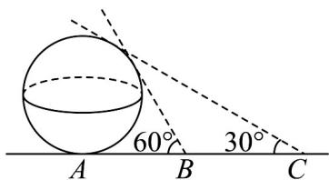

<!-- question-source:start -->
4．如图，已知点 $A$ 是某球体建筑物与水平地面的接触点（切点），地面上 $B$ ， $C$ 两点与点 $A$ 在同一条直线上，

且在点 $A$ 的同侧．若在 $B,C$ 处分别测得球体建筑物的最大仰角为 $60^{\circ}$ 和 $30^{\circ}$ ，且 $BC = 40$ ，则球体建筑物的表

面积为\_\_\_\_。

<!-- question-source:end -->

![[高中/课堂同步/题库/人教A版高中数学同步讲义(2026)/02_必修第二册/第八章 立体几何初步/专题8.3 简单几何体的表面积与体积（高效培优讲义）/强化训练/questions/answers/Q00069786A1.md]]
