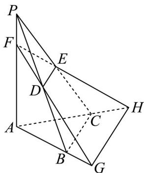

<!-- question-source:start -->
9. 定义两个多面体 $\Omega_1, \Omega_2$ 的相似度 $K = \frac{V_{\text{公共}}}{V_1 + V_2 - V_{\text{公共}}}$ ，其中 $V_{\text{公共}}$ 是多面体 $\Omega_1, \Omega_2$ 重合部分的体积， $V_1, V_2$ 分别

是多面体 $\Omega_1, \Omega_2$ 的体积．如图，在三棱锥 $P - ABC$ 中， $\stackrel{\square\square\square}{PF} = \lambda \stackrel{\square\square\square}{PA}(0 < \lambda < \frac{1}{2}), D, E$ 分别是棱 $PB$ ， $PC$ 的中点，

直线 $DF$ 与直线 $AB$ 交于点 $G$ ，直线 $EF$ 与直线 $AC$ 交于点 $H$ ：

(1) 当 $\lambda = \frac{1}{4}$ 时，求三棱锥 $P - ABC$ 与三棱锥 $F - AGH$ 的相似度 $K$ ：

(2)是否存在 $\lambda$ ，使得三棱锥 $P - ABC$ 与三棱锥 $F - AGH$ 的相似度 $K = \frac{25}{43}$ ?若存在，求出 $\lambda$ 的值；若不存在，

请说明理由.
<!-- question-source:end -->

![[高中/课堂同步/题库/人教A版高中数学同步讲义(2026)/02_必修第二册/第八章 立体几何初步/专题8.3 简单几何体的表面积与体积（高效培优讲义）/强化训练/questions/answers/Q00069790A1.md]]
