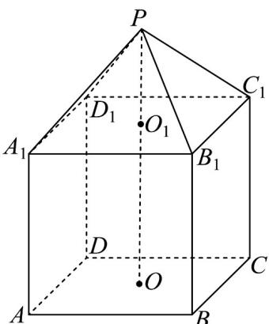

<!-- question-source:start -->
10. 现有一几何体由上，下两部分组成，上部是正四棱锥 $P - A_{1}B_{1}C_{1}D_{1}$ ，下部是正四棱柱 $ABCD - A_{1}B_{1}C_{1}D_{1}$

（如图所示）， $A_{1}P = 6,PO_{1} = 2$ 且正四棱柱的高 $O_{1}O$ 是正四棱锥的高 $PO_{1}$ 的4倍.

(1)求该几何体的表面积；

(2)若 $E, F, G$ 分别为棱 $AA_{1}, C_{1}D_{1}, BC$ 的中点，求四面体 $B_{1} - EFG$ 的体积；

(3)若 $Q, N$ 分别是线段 $A_{1}B_{1}, PB_{1}$ 上的动点，求 $AQ + QN + NC_{1}$ 的最小值．
<!-- question-source:end -->

![[高中/课堂同步/题库/人教A版高中数学同步讲义(2026)/02_必修第二册/第八章 立体几何初步/专题8.3 简单几何体的表面积与体积（高效培优讲义）/强化训练/questions/answers/Q00069791A1.md]]
