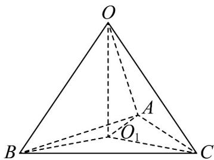

> [!faq]- 《专题8.3 简单几何体的表面积与体积（高效培优讲义）》官方解析
>
> > [!success]- **【答案】** $\frac{32\pi}{3} / \frac{32}{3}\pi$
>
> > [!note]- **【分析】**
> > 设VABC外接圆圆心为 $O_{1}$ ，由题知 $OO_{1}\perp$ 平面ABC， $O_{1}A=\frac{2\sqrt{3}}{3}$ ，根据体积可得 $OO_{1}=\frac{2\sqrt{3}}{3}$ ，再由 $R = OA = \sqrt{O_{1}A^{2} + O_{1}O^{2}}$ 及表面积公式即可求解.
>
> > [!note]- **【解析】**
> > 由题知VABC为等边三角形，设其外接圆圆心为 $O_{1}$
> >
> > 
> >
> > 又VABC的三个顶点都在球O的球面上，所以 $OO_{1}\perp$ 平面ABC
> >
> > $QAC = BC = AB = 2$ $\therefore O_{1}A = O_{1}B = O_{1}C = \frac{2\sqrt{3}}{3}$
> >
> > $V_{O - ABC} = \frac{1}{3} S_{\triangle ABC}OO_1 = \frac{1}{3}\times \frac{1}{2}\times 2\times 2\times \sin 60^{\circ}\times OO_{1} = \frac{2}{3}$ ，解得 $OO_{1} = \frac{2\sqrt{3}}{3}$
> >
> > 则外接球半径 $R = OA = \sqrt{O_{1}A^{2} + O_{1}O^{2}} = \frac{2\sqrt{6}}{3}$
> >
> > 所以球 O 的表面积 $S = 4\pi R^{2} = \frac{32}{3}\pi$
> >
> > 故答案为： $\frac{32\pi}{3}$
