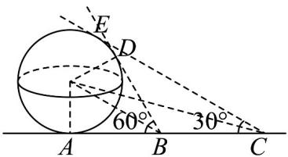

> [!faq]- 《专题8.3 简单几何体的表面积与体积（高效培优讲义）》官方解析
>
> > [!success]- **【答案】** $1600\pi$
>
> > [!note]- **【分析】**
> > 根据题意作出截面图，设球的半径为 $R$ ，根据直角三角形的性质得 $AB = \frac{R}{\tan 30^{\circ}} = \sqrt{3} R$
> >
> > $AC = \frac{R}{\tan 15^{\circ}}$ ，利用 $BC = 40$ 列式，化切为弦利用辅助角公式求得 $R = 20$ ，代入球的表面积公式即可求解
>
> > [!note]- **【解析】**
> > 如图，
> >
> > 
> >
> > 设球的半径为 $R$ ， $AB = \frac{R}{\tan 30^{\circ}} = \sqrt{3} R$ ， $AC = \frac{R}{\tan 15^{\circ}}$
> >
> > $\because BC = \frac{R}{\tan 15^{\circ}} -\sqrt{3} R = 40,\therefore R = \frac{40}{\frac{1}{\tan 15^{\circ}} - \sqrt{3}} = \frac{40\sin 15^{\circ}}{\cos 15^{\circ} - \sqrt{3}\sin 15^{\circ}}$
> >
> > $= \frac{40\sin 15^{\circ}}{2\sin(30^{\circ} - 15^{\circ})} = \frac{20\sin 15^{\circ}}{\sin 15^{\circ}} = 20$ 即球体建筑物的表面积为 $4\pi \times 20^{2} = 1600\pi$
> >
> > 故答案为： $1600\pi$
