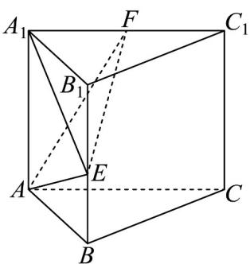
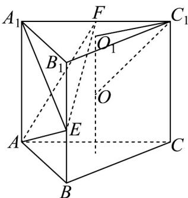
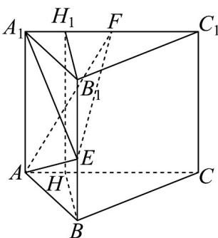
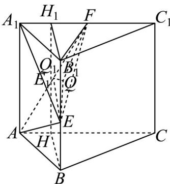
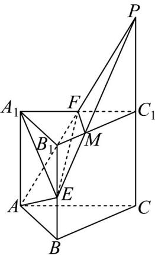

> [!faq]- 《专题8.3 简单几何体的表面积与体积（高效培优讲义）》官方解析
>
> > [!success]- **【答案】**  A. 三棱锥 $A_{1} - AEF$ 的体积为定值 B. 该直三棱柱 $ABC - A_{1}B_{1}C_{1}$ 的外接球的表面积为 $\frac{146\pi}{7}$ C. 当三棱锥 $A_{1} - AEF$ 的外接球的半径最小时，直线 $EF$ 与 $AA_{1}$ 所成角的余弦值为 $\frac{\sqrt{2}}{4}$ D. 若 $E$ 是棱 $BB_{1}$ 的中点，过 $A, E, F$ 三点的平面作该直三棱柱 $ABC - A_{1}B_{1}C_{1}$ 的截面，则所得截面的面积为 $\sqrt{15}$
>
> > [!note]- **【分析】**
> > A选项，根据 $V_{A_1 - AEF} = V_{E - A_1AF}$ ， $S_{\triangle A_1AF}$ 为定值，点 $E$ 到平面 $A_1AF$ 的距离为定值，可得 $V_{E - A_1AF}$ 为定值；
> >
> > B 选项，外接球的球心 O 是上、下底面外接圆的圆心连线的中点，由正弦定理和余弦定理得到外接圆半径
> >
> > $r=\frac{4\sqrt{14}}{7}$ ，从而得到外接球半径和表面积；
> >
> > $^{C}$ 选项，作出辅助线，推导出当 $Q_{1}E_{1}$ 取最小值时， $QQ_{1}$ 最小，即Rr最小，此时 $Q_{1}E_{1}\perp HH_{1}$ ，因为 $Q_{1}$ 是AF的中
> >
> > 点，则 $E_{1}$ 是 $HH_{1}$ 的中点，则 $E$ 是棱 $BB_{1}$ 的中点，进而求出各边长，得到 $\cos \angle FEB_{1} = \frac{B_{1}E}{EF} = \frac{\sqrt{2}}{4}$
> >
> > D 选项，作出辅助线，得到过 A, E, F 三点的截面，并求出面积.
>
> > [!note]- **【解析】**
> > A 选项，根据 $V_{A_1-AEF} = V_{E-A_1AF}$ ，在直三棱柱 $ABC - A_1B_1C_1$ 中， $A_1F$ 长度固定， $AA_1$ 长度固定，所以 $S_{\triangle A_1AF} = \frac{1}{2} \times A_1F \times AA_1$ 为定值，
> >
> > 因为 $BB_{1} / /$ 平面 $AA_{1}CC_{1}$ ，所以点 $E$ 到平面 $A_{1}AF$ 的距离就是 $B$ 到平面 $AA_{1}CC_{1}$ 的距离，为定值，所以 $V_{E - A_1AF}$ 为定值，即三棱锥 $A_{1} - AEF$ 的体积为定值，A正确；
> >
> > B 选项：外接球的球心 O 是上、下底面外接圆的圆心连线的中点，设上底面外接圆圆心为 $O_{1}$ ，外接圆半径为 r
> >
> > 
> >
> > 在 $\triangle A_{1}B_{1}C_{1}$ 中，由余弦定理可得 $\cos \angle B_{1}A_{1}C_{1} = \frac{B_{1}A_{1}^{2} + C_{1}A_{1}^{2} - B_{1}C_{1}^{2}}{2B_{1}A_{1}\cdot C_{1}A_{1}} = \frac{4 + 16 - 18}{2\times 2\times 4} = \frac{1}{8}$
> >
> > 所以 $\sin\angle B_{1}A_{1}C_{1}=\frac{3\sqrt{7}}{8}$ ，由正弦定理得 $\frac{B_{1}C_{1}}{\sin\angle B_{1}A_{1}C_{1}}=\frac{8\sqrt{2}}{\frac{\sqrt{7}}{7}}=2r$ ，所以 $r=\frac{4\sqrt{14}}{7}$ ，
> >
> > 设外接球的半径为 $R$ ，则 $R^2 = \left(\frac{4\sqrt{14}}{7}\right)^2 + 1 = \frac{39}{7}$ ，所以外接球的表面积为 $4\pi R^2 = \frac{156\pi}{7}$ ，故B项错误；
> >
> > C 选项：作 $BH \perp AC$ ，垂足为 $H$ ，作 $B_{1}H_{1} \perp A_{1}C_{1}$ ，垂足为 $H_{1}$
> >
> > 
> >
> > 易证得 $BB_{1}$ 在平面 $ACC_{1}A_{1}$ 上的射影为 $HH_{1}$
> >
> > 则点 E 在平面 $ACC_{1}A_{1}$ 上的射影 $E_{1}$ 在线段 $HH_{1}$ 上，
> >
> > 由 $^{B}$ 选项可知， $\cos\angle BAC=\frac{1}{8}$ ，故 $\frac{AH}{AB}=\frac{AH}{2}=\frac{1}{8}$ ，解得 $AH=\frac{1}{4}$ ，故 $BH=\frac{3\sqrt{7}}{4}$ ，则 $EE_{1}=\frac{3\sqrt{7}}{4}$
> >
> > 设 $AF$ 的中点为 $Q_{1}$ ，外接球的球心为 $Q$ ，半径为 $R_{1}$ ，则 $QQ_{1} \perp$ 平面 $ACC_{1}A_{1}$ ，即 $QQ_{1} // EE_{1}$
> >
> > 在 $Rt\triangle FQQ_{1}$ 中， $QF^{2}=R_{1}^{2}=QQ_{1}^{2}+(\sqrt{2})^{2}$ ①，
> >
> > 又因为 $QE^{2}=R_{1}^{2}=\left(\frac{3\sqrt{7}}{4}-QQ_{1}\right)^{2}+Q_{1}E_{1}^{2}$ ②，
> >
> > 
> >
> > 由①②可得 $\frac{3\sqrt{7}}{2} QQ_{1} = \frac{31}{16} +Q_{1}E_{1}^{2}$ ，所以当 $Q_{1}E_{1}$ 取最小值时， $QQ_{1}$ 最小，即 $R_{1}$ 最小，此时 $Q_{1}E_{1}\perp HH_{1}$ ，因为 $Q_{1}$
> >
> > 是 AF 的中点，则 $E_{1}$ 是 $HH_{1}$ 的中点，则 E 是棱 $BB_{1}$ 的中点.
> >
> > 因为 $AA_{1} //BB_{1}$ ，所以直线 EF 与 $BB_{1}$ 所成角即为直线 EF 与 $AA_{1}$ 所成角。
> >
> > 由 $^{B}$ 项中 $\cos\angle B_{1}A_{1}C_{1}=\frac{1}{8}$
> >
> > 再由余弦定理可得 $B_{1}F = \sqrt{A_{1}B_{1}^{2} + A_{1}F^{2} - 2A_{1}B_{1}\cdot A_{1}F\cos\angle B_{1}A_{1}F} = \sqrt{7}$
> >
> > 因为 $EB_{1} = 1$ ，所以 $EF = 2\sqrt{2}$ ， $\cos \angle FEB_{1} = \frac{B_{1}E}{EF} = \frac{\sqrt{2}}{4}$ ，故C项正确；
> >
> > D项：延长 $A_{1}F$ ， $CC_{1}$ 交于点P，连接PE交 $B_{1}C_{1}$ 于点M，
> >
> > 
> >
> > 则四边形 AEMF 是截面，且点 F 是 AP 的中点，
> >
> > 点 $M$ 是 $B_{1}C_{1}$ 上靠近 $B_{1}$ 的三等分点，由勾股定理求得 $AE = \sqrt{5}, AP = 4\sqrt{2}, EP = 3\sqrt{3}$ ，
> >
> > 因为 $AE^2 + EP^2 = AP^2$ ，所以 $\angle AEP$ 为直角，故 $S_{\triangle AEP} = \frac{1}{2} AE \cdot EP = \frac{3\sqrt{15}}{2}$
> >
> > 又 $S_{\triangle AEP} = \frac{1}{2} AP\cdot EP\sin \angle APE$ ， $S_{\triangle FMP} = \frac{1}{2} FP\cdot MP\sin \angle APE$
> >
> > 易知 $S_{\triangle FMP} = \frac{1}{3} S_{\triangle AEP} = \frac{\sqrt{15}}{2}$ ，所以四边形 $AEMF$ 的面积为 $\frac{3\sqrt{15}}{2} -\frac{\sqrt{15}}{2} = \sqrt{15}$ ，故D项正确·
> >
> > 故选 **ACD**.
