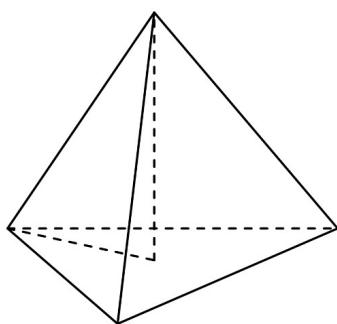
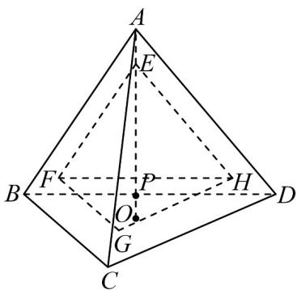

> [!faq]- 《专题8.3 简单几何体的表面积与体积（高效培优讲义）》官方解析
>
> > [!success]- **【答案】** C
>
> > [!note]- **【分析】**
> > 先确定正四面体的棱长与高还有内切球半径的关系，然后根据当 $a$ 取得最小值时，从上到下每层中
> >
> > 放在边缘的小球都与正四面体的面相切，从而计算出棱长的最小值·
>
> > [!note]- **【解析】**
> > 设正四面体的棱长为 a，高为 h，内切球半径为 r，
> >
> > 
> >
> > 则 $a^2 = h^2 + \left(\frac{\sqrt{3}}{2} a \times \frac{2}{3}\right)^2$ ，可得 $h = \frac{\sqrt{6}}{3} a$ ，又 $4 \times \frac{1}{3} \times \frac{1}{2} a^2 \times \frac{\sqrt{3}}{2} \times r = \frac{1}{3} \times \frac{1}{2} a^2 \times \frac{\sqrt{3}}{2} \times h$ ，
> >
> > 可得 $r = \frac{\sqrt{6}}{12} a$ ，即正四面体的高等于其棱长的 $\frac{\sqrt{6}}{3}$ ，正四面体的内切球的半径等于其棱长的 $\frac{\sqrt{6}}{12}$
> >
> > 当 $^{10}$ 个直径为 $^{2}$ 的小球放进棱长为a的正四面体ABCD中，构成三棱锥的形状，有 $^{3}$ 层，从上到下每层的小
> >
> > 球个数依次为 1, 3, 6.
> >
> > 
> >
> > 当 $a$ 取得最小值时，从上到下每层中放在边缘的小球都与正四面体的侧面相切，底层的每个球都与正四面体
> >
> > 的底面相切，任意相邻的两个小球都外切，位于正四面体尖角处的所有相邻小球的球心连线可组成一个正四
> >
> > 面体 EFGH
> >
> > 设底面 $BCD$ 的中心为 $O$ ， $AO$ 与面 $FGH$ 的交点为 $P$ ，则该正四面体 $EFGH$ 的棱长为 $1 + 2 + 1 = 4$ ，可求得其高
> >
> > 为 $EP = 4 \times \frac{\sqrt{6}}{3} = \frac{4\sqrt{6}}{3}$ ， $AE = 1 \times \frac{12}{\sqrt{6}} \times \frac{\sqrt{6}}{3} - 1 = 3$ ，所以正四面体ABCD的高为
> >
> > $AO = AE + EP + PO = 3 + \frac{4\sqrt{6}}{3} + 1 = 4 + \frac{4\sqrt{6}}{3}$ ，进而可求得其棱长 a 的最小值为 $\left(4 + \frac{4\sqrt{6}}{3}\right) \times \frac{3}{\sqrt{6}} = 4 + 2\sqrt{6}$ .
> >
> > 故选 **C**.
