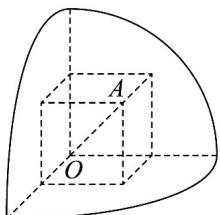
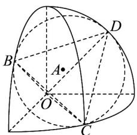
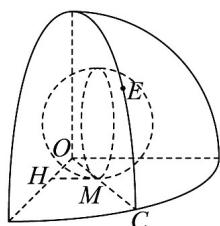
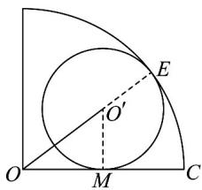
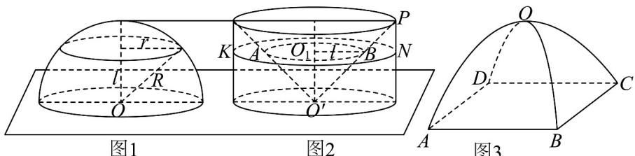
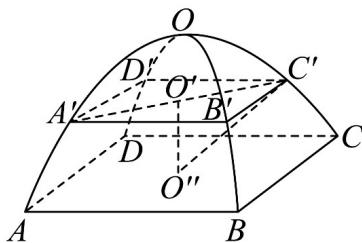
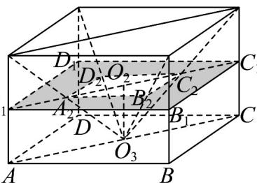

> [!faq]- 《专题8.3 简单几何体的表面积与体积（高效培优讲义）》官方解析
>
> > [!success]- **【答案】** AC
>
> > [!note]- **【分析】**
> > 画出对应图形，放入体对角线为 $2$ 的正方体研究 $\mathsf{A}$ ；放入棱长为 $2$ 的正四面体研究 $\mathsf{B}$ 、 $\mathsf{C}$ ；放入内切
> >
> > 球研究 D.
>
> > [!note]- **【解析】**
> > 设扇形所在圆半径为 R，对于 A，设正方形边长为 a，如图 1，
> >
> > 
> > 图1
> >
> > 
> > 图2
> >
> > 
> > 图3
> >
> > 
> > 图4
> >
> > $OA = R = 2 = \sqrt{3} a \Rightarrow a_{\max} = \frac{2}{\sqrt{3}} \approx 1.15 > 1.1$ 则可容纳的最长对角线，故A正确；
> >
> > 对于 $C$ ，如图2，当圆锥底面与三个圆弧都相切时，
> >
> > 切点 B, C, D 和 O 构成一个边长为 $^{2}$ 的正四面体 O - BCD，
> >
> > $\triangle BCD$ 的外接圆半径为 $\frac{1}{2} \times 2 \times \sqrt{3} \times \frac{2}{3} = \frac{2\sqrt{3}}{3}$
> >
> > 点 $O$ 到平面 $BCD$ 的距离为 $\sqrt{2^2 - \left(\frac{2\sqrt{3}}{3}\right)^2} = \frac{2\sqrt{6}}{3}$
> >
> > 所以可以容纳，故 $^{C}$ 正确；
> >
> > 对于 B，如图 2，同 C 分析， $\triangle BCD$ 的外接圆半径为 $\frac{2\sqrt{3}}{3}<1.9m$ ，不可以容纳，故 B 错误；
> >
> > 对于 D，如图 3，设球半径为 r，
> >
> > 将此时的圆面截出来，可知两圆内切：
> >
> > $$
> > R = 2 = O ^ {\prime} M + O O ^ {\prime} = r + \sqrt {O ^ {\prime} M ^ {2} + O M ^ {2}} = r + \sqrt {r ^ {2} + O H ^ {2} + M H ^ {2}} = r + \sqrt {3 r ^ {2}}
> > $$
> >
> > 解得 $r = \sqrt{3} - 1$ ，比 0.84 小，故 D 错误·故选：AC.
> >
> > 8. 我国南北朝时期的著名数学家祖暅提出了祖暅原理：“幂势既同，则积不容异。”意思是：夹在两个平行平
> >
> > 图3
> >
> > 面之间的两个几何体，被平行于这两个平面的任意一个平面所截，若截面面积都相等，则这两个几何体的体积相等．运用祖暅原理计算球的体积时，构造一个底面半径和高都与球的半径相等的圆柱，与半球（如图1）放置在同一平面上，然后在圆柱内挖去一个以圆柱下底面圆心为顶点，圆柱上底面为底面的圆锥后得到一新几何体（如图2），用任何一个平行于底面的平面去截它们时，可证得所截得的两个截面面积相等，由此可证明新几何体与半球体积 $\frac{1}{2} V_{1}$ 相等，即 $\frac{1}{2} V_{1} = \pi R^{2} \cdot R - \frac{1}{3} \pi R^{2} \cdot R = \frac{2}{3} \pi R^{3}$ ．图3是一种“四脚帐篷”的示意图，其中曲线 $AOC$ 和 $BOD$ 均是以 $^{2}$ 为半径的半圆，平面 $AOC$ 和平面 $BOD$ 均垂直于平面 $ABCD$ ，用任意平行于帐篷底面 $ABCD$ 的平面截帐篷，所得截面四边形均为正方形，类比上述半球的体积计算方法，运用祖暅原理可求得该帐篷的体积为\_\_\_\_．
> >
> > 
> >
> > 【答案】 $\frac{32}{3}$
> >
> > 【分析】根据材料，将帐篷体积转化为同底面的正四棱柱体积与正四棱锥体积之差，计算得到体积·
> >
> > 【详解】设截面与底面的距离为 h，在帐篷中的截面为 $A^{\prime}B^{\prime}C^{\prime}D^{\prime}$ ，截面中心为 $O^{\prime}$ ，底面中心为 $O^{\prime\prime}$ ，
> >
> > 
> >
> > 因为曲线 $AOC$ 是以 $^2$ 为半径的半圆，所以 $O''C' = 2$
> >
> > 所以 $O^{\prime}C^{\prime} = \sqrt{4 - h^{2}}, A^{\prime}C^{\prime} = 2O^{\prime}C^{\prime} = 2\sqrt{4 - h^{2}}, B^{\prime}C^{\prime} = \sqrt{2}\cdot \sqrt{4 - h^{2}}$
> >
> > 所以正方形截面 $A'B'C'D'$ 的面积为 $\left(B'C'\right)^2 = 2\left(4 - h^2\right) = 8 - 2h^2$
> >
> > 设截面截正四棱柱得到的四边形为 $A_{1}B_{1}C_{1}D_{1}$ ，截正四棱锥得到的四边形为 $A_{2}B_{2}C_{2}D_{2}$ ，中心为 $O_{2}$
> >
> > 又设底面中心 $O_{3}$ ，且 $O_{3}O_{2} = h$ ，如图：
> >
> > 
> >
> > 在正四棱柱中，底面正方形边长为 $2\sqrt{2}$ ，高为2
> >
> > 所以 $AO_{3} = 2, \angle AO_{3}A_{2} = \angle CO_{3}C_{2} = 45^{\circ}$ ，所以 $\angle A_{2}O_{3}C_{2} = 90^{\circ}$
> >
> > 又因为 $O_{3}A_{2} = O_{3}C_{2}$ ，所以 $\triangle A_2O_3C_2$ 是等腰直角三角形，所以 $A_{2}C_{2} = 2O_{3}O_{2} = 2h$
> >
> > 所以正方形截面 $A_{2}B_{2}C_{2}D_{2}$ 的边长为 $\sqrt{2} h$ ，所以正方形截面 $A_{2}B_{2}C_{2}D_{2}$ 的面积为 $2h^{2}$
> >
> > 所以阴影部分面积 $S = S_{A_1B_1C_1D_1} - S_{A_2B_2C_2D_2} = 8 - 2h^2$ ，与截面 $A'B'C'D'$ 面积相等，
> >
> > 由祖暅原理知，帐篷体积为正四棱柱体积减去正四棱锥体积，
> >
> > 即 $V_{帐篷}=V_{正四棱柱}-V_{正四棱锥}=\left(2\sqrt{2}\right)^{2}\times2-\frac{1}{3}\times\left(2\sqrt{2}\right)^{2}\times2=\frac{32}{3}$ ，故答案为： $\frac{32}{3}$
