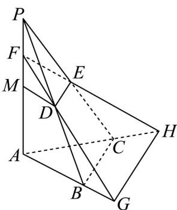

> [!faq]- 《专题8.3 简单几何体的表面积与体积（高效培优讲义）》官方解析
>
> > [!success]- **【答案】** (1) $\frac{15}{28}$ ; (2) 存在 $\lambda = \frac{18 - \sqrt{66}}{43}$ 满足题意.
>
> > [!note]- **【分析】**
> > （1）设VABC的面积为S，点P到平面ABC的距离为h，点C到平面PAB的距离为 $h_{c}$ ，取棱PA的
> >
> > 中点 $M$ ，连接DM.注意到点 $C$ 到平面PAB的距离 $h_c$ 是点 $E$ 到平面PAB的距离 $h_E$ 的2倍，可得 $V_{\text{公共}} = \frac{5}{16} Sh$
> >
> > <!-- source-part:2 pages:51-57 -->
> >
> > 由 $DM // AG$ ， $\frac{FM}{FA} = \frac{1}{3}$ ，可得 $S_{\triangle AGH} = \frac{9}{4} S_{\triangle ABC}$
> >
> > 点 $F$ 到平面 $AGH$ 的距离为 $\frac{3}{4} h$ ，据此可得 $V_{2} = \frac{9}{16} Sh$ ，然后由相似度定义可得答案；
> >
> > (2) 假设存在 $\lambda$ ，使相似度 $K = \frac{25}{43}$ ，类比 (1)，可得 $K = \frac{-4\lambda^{3} + 20\lambda^{2} - 17\lambda + 4}{8\lambda^{2} - 11\lambda + 4} = \frac{25}{43}$
> >
> > 化简可得 $43\lambda^3 - 165\lambda^2 + 114\lambda - 18 = 0$ ，解方程结合 $0 < \lambda < \frac{1}{2}$ 可得答案.
>
> > [!note]- **【解析】**
> > （1）设VABC的面积为S，点P到平面ABC的距离为h，点C到平面PAB的距离为 $h_{c}$
> >
> > 则三棱锥 $P - ABC$ 的体积 $V_{1} = \frac{1}{3} Sh = \frac{1}{3} S_{\triangle PAB}h_{c}$
> >
> > 取棱 PA 的中点 M ，连接 DM .
> >
> > 因为 $D$ ， $M$ 分别是棱 $PB$ ， $PA$ 的中点，所以 $DM / / AB, DM = \frac{1}{2} AB$
> >
> > 所以 $\triangle PDM\sim \triangle PBA$ ，则 $S_{\triangle PDM} = \frac{1}{4} S_{\triangle PBA}$
> >
> > (1) 因为 $\lambda=\frac{1}{4}$ ，所以 F 是线段 PM 的中点，所以 $S_{\triangle PDF}=\frac{1}{2}S_{\triangle PDM}=\frac{1}{8}S_{\triangle PBA}$
> >
> > 因为 E 是线段 PC 的中点，所以点 C 到平面 PAB 的距离 $h_{C}$ 是点 E 到平面 PAB 的距离 $h_{E}$ 的 2 倍，
> >
> > 所以三棱锥 $E - PDF$ 的体积 $V = \frac{1}{3} S_{\triangle PDF}h_E = \frac{1}{3}\times \frac{1}{8} S_{\triangle PBA}\times \frac{1}{2} h_C = \frac{1}{48} S_{\triangle PBA}\cdot h_C = \frac{1}{48} Sh$
> >
> > 则三棱锥 $P - ABC$ 与三棱锥 $F - AGH$ 的重合部分的体积 $V_{\text{公共}} = V_1 - V = \frac{5}{16} Sh$
> >
> > 因为 $DM / / AG$ ，且 $\frac{FM}{FA} = \frac{1}{3}$ ，所以 $AG = 3DM$ ，所以 $\frac{AB}{AG} = \frac{2}{3}$
> >
> > 易证 $BC // GH$ ，则 $\mathrm{V}ABC \sim \mathrm{V}AGH$ ，所以 $S_{\triangle AGH} = \frac{9}{4} S_{\triangle ABC}$
> >
> > 因为 $\lambda = \frac{1}{4}$ ，所以点 $F$ 到平面 $AGH$ 的距离为 $\frac{3}{4} h$
> >
> > 则三棱锥 $F - AGH$ 的体积 $V_{2} = \frac{1}{3} S_{\triangle AGH}\times \frac{3}{4} h = \frac{1}{3}\times \frac{9}{4} S_{\triangle ABC}\times \frac{3}{4} h = \frac{9}{16} Sh$
> >
> > 故三棱锥与三棱锥的相似度 $K = \frac{\frac{5}{16}Sh}{\frac{1}{3}Sh + \frac{9}{16}Sh - \frac{5}{16}Sh} = \frac{15}{28}$
> >
> > (2) 因为 $\overline{PF} = \lambda \overline{PA}$ ，所以 $\frac{|\overline{PF}|}{|PA|} = \lambda, \frac{|\overline{PF}|}{|PM|} = 2\lambda$ ，所以 $S_{\triangle PDF} = 2\lambda S_{\triangle PDM} = \frac{\lambda}{2} S_{\triangle PBA}$
> >
> > 因为 E 是线段 PC 的中点，所以点 C 到平面 PAB 的距离 $h_{C}$ 是点 E 到平面 PAB 的距离 $h_{E}$ 的 2 倍，
> >
> > 所以三棱锥 $E - PDF$ 的体积 $V^{\prime} = \frac{1}{3} S_{\triangle PDF}h_{E} = \frac{1}{3}\times \frac{\lambda}{2} S_{\triangle PBA}\times \frac{1}{2} h_{C} = \frac{\lambda}{12} S_{\triangle PBA}\cdot h_{C} = \frac{\lambda}{12} Sh$
> >
> > 则三棱锥 P-ABC 与三棱锥 F-AGH 的重合部分的体积 $V_{公共} = V_{1} - V' = \left( \frac{4 - \lambda}{12} \right) Sh$
> >
> > 因为 $DM // AG$ ，且 $\frac{FM}{FA} = \frac{1 - 2\lambda}{2 - 2\lambda}$ ，所以 $AG = \frac{2 - 2\lambda}{1 - 2\lambda} DM$ ，所以 $\frac{AB}{AG} = \frac{1 - 2\lambda}{1 - \lambda}$
> >
> > 易证 $BC // GH$ ，则 $\triangle ABC \sim \triangle AGH$ ，所以 $S_{\triangle AGH} = \frac{(1 - \lambda)^2}{(1 - 2\lambda)^2} S_{\triangle ABC}$
> >
> > 因为点 $P$ 到平面 $ABC$ 的距离为 $h$ ，所以点 $F$ 到平面 $AGH$ 的距离为 $(1 - \lambda)h$
> >
> > 则三棱锥 $F - AGH$ 的体积 $V_{2} = \frac{1}{3} S_{\triangle AGH}\times (1 - \lambda)h = \frac{1}{3}\times \frac{(1 - \lambda)^{2}}{(1 - 2\lambda)^{2}} S_{\triangle ABC}\times (1 - \lambda)h = \frac{(1 - \lambda)^{3}}{3(1 - 2\lambda)^{2}} Sh$ 故三棱锥与三棱锥的相似度 $K = \frac{\left(\frac{4 - \lambda}{12}\right)Sh}{\frac{1}{3}Sh + \frac{(1 - \lambda)^3}{3(1 - 2\lambda)^2}Sh - \left(\frac{4 - \lambda}{12}\right)Sh} = \frac{-4\lambda^3 + 20\lambda^2 - 17\lambda + 4}{8\lambda^2 - 11\lambda + 4}$
> >
> > 假设存在满足条件的 $\lambda$ ，则 $\frac{-4\lambda^3 + 20\lambda^2 - 17\lambda + 4}{8\lambda^2 - 11\lambda + 4} = \frac{25}{43}$ ，所以 $43\lambda^3 - 165\lambda^2 + 114\lambda - 18 = 0$
> >
> > 所以 $(\lambda - 3)(43\lambda^2 - 36\lambda + 6) = 0$ ，解得 $\lambda = 3$ 或 $\lambda = \frac{18 + \sqrt{66}}{43}$ 或 $\lambda = \frac{18 - \sqrt{66}}{43}$
> >
> > 因为 $0 < \lambda < \frac{1}{2}$ ，所以 $\lambda = \frac{18 - \sqrt{66}}{43}$ ，即存在 $\lambda = \frac{18 - \sqrt{66}}{43}$ ，使得三棱锥 $P - ABC$ 与三棱锥 $F - AGH$ 的相似度 $K = \frac{25}{43}$ 。
> >
> > 
