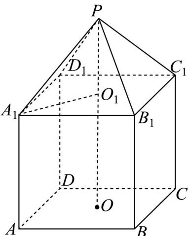
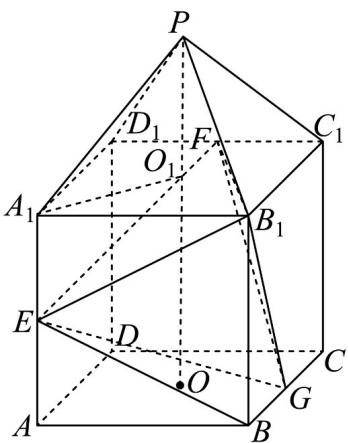
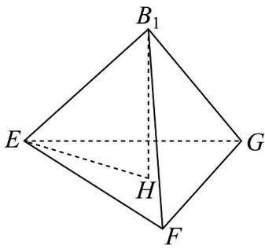
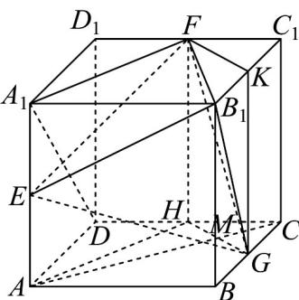
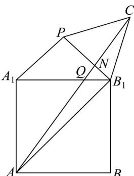

> [!faq]- 《专题8.3 简单几何体的表面积与体积（高效培优讲义）》官方解析
>
> > [!success]- **【答案】** (1) $320 + 32\sqrt{5}$ (2)96 (3) $\frac{8}{3}\sqrt{29 + 8\sqrt{5}}$
>
> > [!note]- **【分析】**
> > （1）连接 $A_{1}O_{1}$ ，则 $PO_{1} \perp A_{1}O_{1}$ ，求得 $A_{1}O_{1} = 4\sqrt{2}$ ，得到 $A_{1}B_{1} = 8$ ，且 $OO_{1} = 8$ ，结合棱锥的侧面积公
> >
> > 式和正方形的面积公式，即可求解；
> >
> > (2) 解法 $^{1}$ ：根据题意，得到三棱锥 $B_{1}-EFK$ 为底面边长为 $4\sqrt{6}$ ，侧棱长 $4\sqrt{5}$ 正三棱锥，
>
> > [!note]- **【解析】**
> > 解法 $^{2}$ ：作 $FH \perp CD$ 于点 H， $GK \perp B_{1}C_{1}$ 于点 K，结合割补法，利用棱柱和棱锥的体积公式，即可求解；
> >
> > 解法 $^{3}$ ：利用体积转换法，化简 $V_{E-B_{1}FG} = \left( \frac{1}{2} + \frac{1}{4} + \frac{1}{8} \right) \cdot V_{B_{1}-A_{1}FG} + \frac{1}{8} V_{C-AB_{1}D_{1}}$ ，结合锥体的体积公式，即可求解
> >
> > (3) 将长方形 $ABB_{1}A_{1}$ ， $\triangle PA_{1}B_{1}$ 和 $\triangle PB_{1}C_{1}$ 展开在一个平面，设 $\angle A_{1}B_{1}P = \alpha$ ，求得 $\cos \angle AB_{1}C_{1}$ 的值，得到
> >
> > 当 $A, Q, N, C_{1}$ 四点共线时， $AQ + QN + NC_{1}$ 最短，结合余弦定理，即可求解
> >
> > 【详解】（1）连接 $A_{1}O_{1}$ ，则 $PO_{1} \perp A_{1}O_{1}$ ，因为 $PA_{1} = 6, PO_{1} = 2$ ，所以 $A_{1}O_{1} = \sqrt{6^{2} - 2^{2}} = 4\sqrt{2}$
> >
> > 所以正方形 $A_{1}B_{1}C_{1}D_{1}$ 中，可得 $A_{1}B_{1}=4\sqrt{2}\times\sqrt{2}=8$
> >
> > 又因为 $OO_{1} = 4PO_{1} = 8$ ，在 $\triangle A_1B_1P_1$ 中， $A_{1}P = 6 = B_{1}P = 6,A_{1}B_{1} = 8$
> >
> > 故四棱锥的侧面积为 $S_{1} = 4 \times \frac{1}{2} \times 8 \times \sqrt{6^{2} - 4^{2}} = 32\sqrt{5}$
> >
> > 又由正方体 $^{5}$ 个面的面积为 $S_{2}=5\times8^{2}=320$
> >
> > 所以多面体的表面积为 $S = S_{1} + S_{2} = 320 + 32\sqrt{5}$
> >
> > 
> >
> > (2)
> > 解法 1：在直角 $\triangle ABE$ 中，可得 $B_{1}E = \sqrt{A_{1}E^{2} + A_{1}B_{1}^{2}} = 4\sqrt{5}$ ，则 $B_{1}E = B_{1}F = B_{1}G$
> >
> > 又由 $EF = \sqrt{A_1F^2 + A_1E^2} = \sqrt{4^2 + (4\sqrt{5})^2} = 4\sqrt{6}$ ，同理可得： $FG = EG = 4\sqrt{6} = EF$
> >
> > 所以三棱锥 $B_{1} - EFG$ 为底面边长为 $4\sqrt{6}$ ，侧棱长为 $4\sqrt{5}$ 正三棱锥，
> >
> > 如图所示，过点 $B_{1}$ 作底面的高，垂足为H，
> >
> > 因为底面是正三角形 $EFG$ ，故 $H$ 是正三角形 $EFG$ 的重心，可得 $EH = 4\sqrt{2}$
> >
> > 所以 $B_{1}H = \sqrt{B_{1}E^{2} - EH^{2}} = \sqrt{80 - 32} = 4\sqrt{3}$ 即三棱锥 $B_{1} - EFG$ 的高为 $h = 4\sqrt{2}$
> >
> > 所以 $V_{B_{1}-EFG}=\frac{1}{3}B_{1}H\cdot S_{EFG}=\frac{1}{3}\cdot\frac{\sqrt{3}}{4}\left(4\sqrt{6}\right)^{2}\cdot4\sqrt{3}=96$
> >
> > 
> >
> > 
> >
> > 解法 $^{2}$ ：如图所示，作 $FH \perp CD$ 于点 H ， $GK \perp B_{1}C_{1}$ 于点 K
> >
> > 则 $V_{E - FB_1G} = V_{ABGH - A_1B_1KF} - V_{G - B_1KF} - V_{F - A_1B_1E} - V_{E - FHG} - V_{E - AHGB} - V_{E - B_1BG}$
> >
> > 其中 $V_{E-FHG} = V_{A-FHG} = V_{F-AHG} = \frac{1}{3} S_{VFHG} \cdot AM = \frac{224}{3}$
> >
> > 所以 $V_{B_1 - EFG} = V_{E - FB_1G} = 320 - \frac{64}{3} -\frac{128}{3} -\frac{224}{3} -\frac{128}{3} -\frac{128}{3} = 96$
> >
> > 
> >
> > 解法 $^{3}$ ：转换法，由 $V_{E-B_{1}FG}=\frac{1}{2}(V_{A_{1}-B_{1}FG}+V_{A-B_{1}FG})=\frac{1}{2}V_{G-A_{1}B_{1}F}+\frac{1}{2}V_{F-AB_{1}G}$
> >
> > $$
> > = \frac {1}{2} V _ {G - A _ {1} B _ {1} F} + \frac {1}{4} \left(V _ {C _ {1} - A B _ {1} G} + V _ {D _ {1} - A B _ {1} G}\right) = \frac {1}{2} V _ {A _ {1} - B _ {1} F G} + \frac {1}{4} V _ {C _ {1} - A B _ {1} G} + \frac {1}{8} \left(V _ {B - A B _ {1} D _ {1}} + V _ {C - A B _ {1} D _ {1}}\right)
> > $$
> >
> > $$
> > = \frac {1}{2} V _ {B _ {1} - A _ {1} F G} + \frac {1}{4} V _ {A - C _ {1} B _ {1} G} + \frac {1}{8} V _ {D _ {1} - A B B _ {1}} + \frac {1}{8} V _ {C - A B _ {1} D _ {1}} = (\frac {1}{2} + \frac {1}{4} + \frac {1}{8}) \cdot V _ {B _ {1} - A _ {1} F G} + \frac {1}{8} V _ {C - A B _ {1} D _ {1}}
> > $$
> >
> > $$
> > = \frac {7}{8} \times \frac {1}{3} \times 8 \times \frac {8 \times 8}{2} + \frac {1}{8} \left(8 ^ {3} - \frac {4}{6} \times 8 ^ {3}\right) = \frac {2 5 6}{3} - \frac {6 4}{3} = 9 6,
> > $$
> >
> > 所以四面体 $B_{1} - EFG$ 的体积为96.
> >
> > (3) 如图所示，将长方形 $ABB_{1}A_{1}$ ， $\triangle PA_{1}B_{1}$ 和 $\triangle PB_{1}C_{1}$ 展开在一个平面，
> >
> > 可得 $PA_{1}=PB_{1}=PC_{1}=6, A_{1}B_{1}=B_{1}C_{1}=8$
> >
> > $$
> > \text { 设 } \angle A _ {1} B _ {1} P = \alpha , \cos \angle A _ {1} B _ {1} P = \cos \angle P B _ {1} C _ {1} = \cos \alpha = \frac {4}{6} = \frac {2}{3},
> > $$
> >
> > $$
> > A _ {1} B _ {1} = A A _ {1} = 8, A B _ {1} = 8 \sqrt {2} \angle A _ {1} B _ {1} A = \frac {\pi}{4}, \text {所以} \sin \alpha = \frac {\sqrt {5}}{3}
> > $$
> >
> > $$
> > \text {所以} \sin 2 \alpha = 2 \sin \alpha \cos \alpha = 2 \times \frac {\sqrt {5}}{3} \times \frac {2}{3} = \frac {4 \sqrt {5}}{9}, \cos 2 \alpha = 1 - 2 \sin^ {2} \alpha = 1 - 2 \times \left(\frac {\sqrt {5}}{3}\right) ^ {2} = - \frac {1}{9}
> > $$
> >
> > $$
> > \cos \angle A B _ {1} C _ {1} = \cos \left(\frac {\pi}{4} + 2 \alpha\right) = \cos \frac {\pi}{4} \cos 2 \alpha - \sin \frac {\pi}{4} \sin 2 \alpha = - \frac {\sqrt {2} + 4 \sqrt {1 0}}{1 8},
> > $$
> >
> > 当 $A, Q, N, C_{1}$ 四点共线时， $AQ + QN + NC_{1}$ 最短，所以
> >
> > $$
> > A C _ {1} = \sqrt {A B _ {1} ^ {2} + B _ {1} C _ {1} ^ {2} - 2 A B _ {1} \cdot B _ {1} C _ {1} \cdot \cos \angle A B _ {1} C} = \frac {8}{3} \sqrt {2 9 + 8 \sqrt {5}}
> > $$
> >
> > 所以 $AQ + QN + NC_{1}$ 的最小值为 $\frac{8}{3}\sqrt{29 + 8\sqrt{5}}$
> >
> > 
