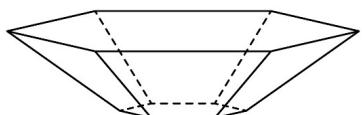

<!-- question-source:start -->
【变式3】乐乐同学在学校的 $^{3}D$ 打印社为全班 $^{50}$ 位同学每人打印了一个盘子，盘子的形状为一个倒置的正

六棱台，盘子的底面正六边形边长为 $2\mathrm{cm}$ ，盘口正六边形边长为 $6\mathrm{cm}$ ，侧棱长为 $5\mathrm{cm}$ 。如果乐乐要在每个盘子

的内外表面涂一层防水涂料，每平方厘米需要 $0.05\mathrm{g}$ 涂料，则共需要涂料约为（）（不考虑盘子厚度，结

果保留整数，参考数据： $\sqrt{3}\approx 1.73,\sqrt{21}\approx 4.58$

A 241g B 602g C 702g D 718g
<!-- question-source:end -->

![[高中/课堂同步/题库/人教A版高中数学同步讲义(2026)/02_必修第二册/第八章 立体几何初步/专题8.3 简单几何体的表面积与体积（高效培优讲义）/题型01_棱柱_棱锥_棱台的表面积/questions/answers/Q00069773A1.md]]
