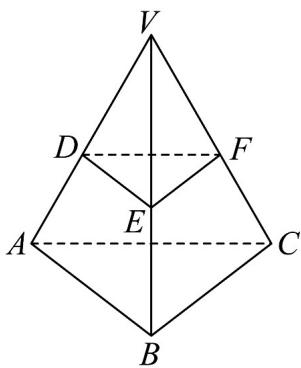

> [!faq]- 《专题8.3 简单几何体的表面积与体积（高效培优讲义）》官方解析
>
> > [!success]- **【答案】** D
>
> > [!note]- **【分析】**
> > 画出图形，设 $DE = 2k$ ，分别求出四面体 $V - DEF$ 的表面积和三棱台 $DEF - ABC$ 的表面积，由这两
> >
> > 部分的表面积相等，求出 $k^2 = \frac{8}{3}$ ，即可求出截面面积
>
> > [!note]- **【解析】**
> > 如图正四面体 $V - ABC$ ， $VC = VA = VB = AB = AC = BC = 4$
> >
> > VDEF: VABC，令 $DE = 2k$ ，截面 $S_{\triangle DEF} = \frac{1}{2}\cdot 2k\cdot 2k\cdot \frac{\sqrt{3}}{2} = \sqrt{3} k^2$
> >
> > 由 $DE // AB$ ，得 $\frac{VD}{VA} = \frac{DE}{AB}$ ，即 $\frac{VD}{4} = \frac{2k}{4}$ ，则 $VD = 2k$ ，
> >
> > $S_{\triangle VDE} = \frac{1}{2}\cdot VD\cdot DE\cdot \sin 60^{\circ} = \sqrt{3} k^{2}$ ，四面体 $V - DEF$ 为正四面体，
> >
> > 四面体 $V - DEF$ 的表面积为： $S_{1} = 4\sqrt{3} k^{2}$
> >
> > 梯形 DEAB 的面积为 $S_{\triangle YAB} - S_{\triangle YDE} = 4\sqrt{3} - \sqrt{3}k^{2}$ ，则三棱台 DEF - ABC 的表面积为：
> >
> > $$
> > S _ {2} = (4 \sqrt {3} - \sqrt {3} k ^ {2}) \cdot 3 + \sqrt {3} k ^ {2} + 4 \sqrt {3} = 1 6 \sqrt {3} - 2 \sqrt {3} k ^ {2}
> > $$
> >
> > 由 $S_{1}=S_{2}$ ，得 $16\sqrt{3}-2\sqrt{3}k^{2}=4\sqrt{3}k^{2}$ ，解得 $k^{2}=\frac{8}{3}$ ，所以截面 $S_{\triangle DEF}=\sqrt{3}k^{2}=\frac{8\sqrt{3}}{3}$ 。
> >
> > 故选：D
> >
> > 
