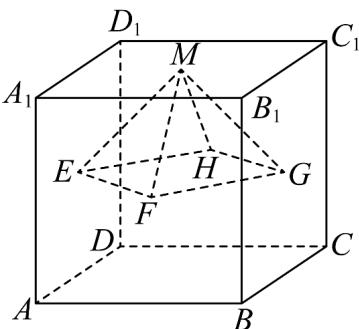
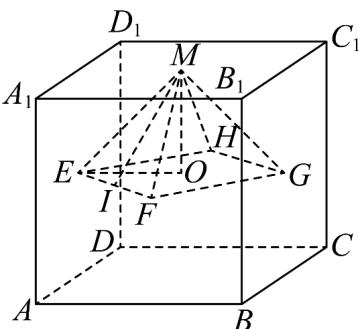

> [!faq]- 《专题8.3 简单几何体的表面积与体积（高效培优讲义）》官方解析
>
> > [!success]- **【答案】** 
>
> > [!note]- **【分析】**
> > 由题意得出四棱锥 $M - EFGH$ 的底面 $EFGH$ 是边长为 $\frac{\sqrt{2}}{2}$ 的正方形，四个侧面都是边长为 $\frac{\sqrt{2}}{2}$ 的等边
> >
> > 三角形，进一步结合棱锥的表面积公式即可求解·
>
> > [!note]- **【解析】**
> > 如图所示：
> >
> > 
> >
> > 由题意可得，底面四边形 $EFGH$ 为边长为 $\frac{\sqrt{2}}{2}$ 的正方形，其面积 $S_{EFGH} = \left(\frac{\sqrt{2}}{2}\right)^2 = \frac{1}{2}$
> >
> > 设 $I$ 为 $EF$ 中点， $O$ 为正方形 $EFGH$ 中心，则 $MO = \frac{1}{2}$ ， $EO = \frac{1}{2}$
> >
> > 显然 $MO \perp EO$ ，所以正四棱锥M-EFGH的侧棱 $ME = \frac{\sqrt{2}}{2}$ ，同理 $MF = \frac{\sqrt{2}}{2}$
> >
> > 又 $EF = \frac{\sqrt{2}}{2}$ ，所以正四棱锥 $M - EFGH$ 的四个侧面都是边长为 $\frac{\sqrt{2}}{2}$ 的等边三角形，
> >
> > 设四棱锥 M-EFGH 的表面积是 S，
> >
> > $$
> > S = \left(\frac {\sqrt {2}}{2}\right) ^ {2} + 4 \times \frac {1}{2} \times \left(\frac {\sqrt {2}}{2}\right) ^ {2} \times \frac {\sqrt {3}}{2} = \frac {\sqrt {3} + 1}{2}.
> > $$
> >
> > 故答案为： $\frac{\sqrt{3}+1}{2}$
