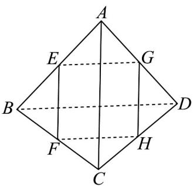

> [!faq]- 《专题8.3 简单几何体的表面积与体积（高效培优讲义）》官方解析
>
> > [!success]- **【答案】** $16 \sqrt{3}$
>
> > [!note]- **【分析】**
> > 由截面是边长为 $^{2}$ 正方形，可得正四面体的棱长为 $^{4}$ ，再根据三角形的面积公式求解即可·
>
> > [!note]- **【解析】**
> > 如图正四面体 $ABCD$ ，截面正方形由 $^4$ 条边的中点构成，
> >
> > 由于正四面体的对称性，这 $^{4}$ 个中点共面且形成正方形，
> >
> > 即四边形 $EFHG$ 是边长为 $2$ 的正方形，
> >
> > 所以正四面体 ABCD 的棱长为 4.
> >
> > 又因为正四面体 ABCD 每个面都是等边三角形，
> >
> > 所以 $S_{ABCD}=4S_{\triangle ABC}=4\times\frac{1}{2}\times AB\times AC\times\sin60^{\circ}=2\times4\times4\times\frac{\sqrt{3}}{2}=16\sqrt{3}$
> >
> > 故答案为： $16\sqrt{3}$
> >
> > 
> >
> > 方法技巧
> >
> > 求多面体表面积注意事项
> >
> > 1、多面体的表面积转化为各面面积之和.
> >
> > 2、解决有关棱台的问题时，常用两种解题
> > 思路：一是把基本量转化到梯形中去解决；二是把棱台还原成棱锥，
> >
> > 利用棱锥的有关知识来解决.
