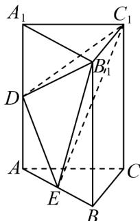

<!-- question-source:start -->
【变式1】如图，在直三棱柱 $ABC - A_{1}B_{1}C_{1}$ 中， $E$ 是 $AB$ 的三等分点（靠近点 $A$ ）， $D$ 是 $AA_{1}$ 的中点，则三棱

锥 $D - B_{1}C_{1}E$ 的体积与三棱柱 $ABC - A_{1}B_{1}C_{1}$ 的体积之比是

<!-- question-source:end -->

![[高中/课堂同步/题库/人教A版高中数学同步讲义(2026)/02_必修第二册/第八章 立体几何初步/专题8.3 简单几何体的表面积与体积（高效培优讲义）/题型02_棱柱_棱锥_棱台的体积/questions/answers/Q00069775A1.md]]
