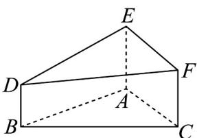

<!-- question-source:start -->
【变式2】如图，在几何体 $ABC - EDF$ 中，VABC是边长为 $^2$ 的等边三角形，侧棱 $AE, CF, BD$ 均垂直于底面 $ABC$ , $BD = 3$ , $FC = 4$ , $AE = 5$ ，则该几何体的体积是（）·

A. $3\sqrt{3}$ B. $4\sqrt{3}$ C. $5\sqrt{3}$ D. $6\sqrt{3}$
<!-- question-source:end -->

![[高中/课堂同步/题库/人教A版高中数学同步讲义(2026)/02_必修第二册/第八章 立体几何初步/专题8.3 简单几何体的表面积与体积（高效培优讲义）/题型02_棱柱_棱锥_棱台的体积/questions/answers/Q00069776A1.md]]
