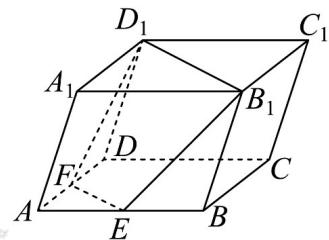

<!-- question-source:start -->
【变式3】如图，在平行六面体 $AC_{1}$ 中， $E$ 是 $AB$ 的中点，过 $B_{1}, D_{1}, E$ 三点的截面 $D_{1}B_{1}EF$ 把平行六面体分成两

个部分，则左右两部分体积之比为（）·

A 3:4 B 5:7 C 4:7 D 7:17
<!-- question-source:end -->

![[高中/课堂同步/题库/人教A版高中数学同步讲义(2026)/02_必修第二册/第八章 立体几何初步/专题8.3 简单几何体的表面积与体积（高效培优讲义）/题型02_棱柱_棱锥_棱台的体积/questions/answers/Q00069777A1.md]]
