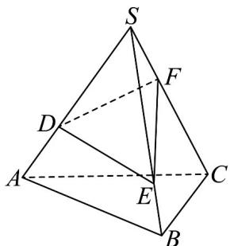

<!-- question-source:start -->
【典例1】如图，一个盛满水的可以转动的三棱锥容器，三条侧棱上各有一个小洞 $D$ ， $E$ ， $F$ ，且知道

$SD:DA=SE:EB=CF:FS=2:1$ ，若仍用这个容器盛水，则最多可盛原来水的\_\_\_\_。

<!-- question-source:end -->

![[高中/课堂同步/题库/人教A版高中数学同步讲义(2026)/02_必修第二册/第八章 立体几何初步/专题8.3 简单几何体的表面积与体积（高效培优讲义）/题型02_棱柱_棱锥_棱台的体积/questions/answers/Q00069988A1.md]]
