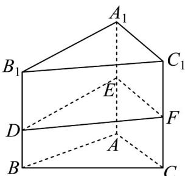

> [!faq]- 《专题8.3 简单几何体的表面积与体积（高效培优讲义）》官方解析
>
> > [!success]- **【答案】** B
>
> > [!note]- **【分析】**
> > 构造一个底面是边长为 $^{2}$ 的等边三角形，侧棱长为 $^{8}$ 的正三棱柱，分析知几何体ABC-EDF的体积为该正三棱柱的一半，结合三棱柱体积公式即可计算·
>
> > [!note]- **【解析】**
> > 如图所示，构造一个底面是边长为 $^{2}$ 的等边三角形，侧棱长为 $^{8}$ 的正三棱柱 $ABC-A_{1}B_{1}C_{1}$
> >
> > 
> >
> > 其中， $B_{1}D = 8 - 3 = 5 = AE$ ， $A_{1}E = 8 - 5 = 3 = BD$ ， $C_1F = 8 - 4 = 4 = CF$
> >
> > 因此 $V_{ABC-EDF}=V_{A_{1}B_{1}C_{1}-EDF}$ ，即 $V_{ABC-EDF}=\frac{1}{2}V_{ABC-A_{1}B_{1}C_{1}}$ ，
> >
> > 根据三棱柱体积公式， $V_{ABC-A_{1}B_{1}C_{1}}=\frac{1}{2}\times2\times2\times\sin60^{\circ}\times8=8\sqrt{3}$
> >
> > 故该几何体的体积是 $V_{ABC-EDF} = \frac{1}{2} \times 8\sqrt{3} = 4\sqrt{3}$
> >
> > 故选 **B**.
