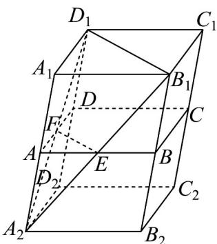

> [!faq]- 《专题8.3 简单几何体的表面积与体积（高效培优讲义）》官方解析
>
> > [!success]- **【答案】** D
>
> > [!note]- **【分析】**
> > 被截面 $D_{1}B_{1}EF$ 分割成的左边的几何体是个三棱台，要求其体积，由于 $E$ 为中点，可补成锥体 $A_{2} - A_{1}B_{1}D_{1}$ 就能迅速求解
>
> > [!note]- **【解析】**
> > 解析 解法 $^{1}$ ：如图，作 $B_{1}E$ 的延长线，交 $A_{1}A$ 的延长线于点 $A_{2}$ ，由 E 为 AB 的中点知 A 为 $A_{1}A_{2}$ 的中点，连结 $A_{2}D_{1}$ ，则 $A_{2}D_{1}$ 与 AD 的交点必为点 F．作 $A_{2}D_{2} // AD$ 且 $A_{2}D_{2} = AD$ ， $A_{2}B_{2} // AB$ 且 $A_{2}B_{2} = AB$ ， $D_{2}C_{2}//DC$ 且 $D_{2}C_{2}=DC$ ，即补上一个全等的平行六面体．
> >
> > 
> >
> > 因为平面 ABCD // 平面 $A_{1}B_{1}C_{1}D_{1}$
> >
> > 且截面 $D_{1}B_{1}EF \cap$ 平面 $ABCD = EF$ ，截面 $D_{1}B_{1}EF \cap$ 平面 $A_{1}B_{1}C_{1}D_{1} = B_{1}D_{1}$
> >
> > 所以 $EF \parallel B_{1}D_{1}$ ，又因为 $BD \parallel B_{1}D_{1}$ ，所以 $EF \parallel BD$ ，
> >
> > 又 E 是 AB 的中点，所以 F 是 AD 的中点，则截面 $D_{1}B_{1}EF$ 为梯形，
> >
> > $$
> > \frac {S _ {\triangle A E F}}{S _ {\triangle A _ {1} B _ {1} D _ {1}}} = \frac {\frac {1}{2} \cdot A F \cdot A E \cdot \sin A}{\frac {1}{2} \cdot A _ {1} D _ {1} \cdot A _ {1} B _ {1} \cdot \sin A _ {1}} = \frac {\frac {1}{2} \times \frac {1}{2} \times A _ {1} D _ {1} \times \frac {1}{2} \times A _ {1} B _ {1} \times \sin A}{\frac {1}{2} \times A _ {1} D _ {1} \times A _ {1} B _ {1} \times \sin A _ {1}} = \frac {1}{4},
> > $$
> >
> > 又 $h_{A_2 - AEF} = \frac{1}{2} h_{A_2 - A_1B_1D_1}$
> >
> > 所以 $V_{A_{2}-AEF}=\frac{1}{8}V_{A_{2}-A_{1}B_{1}D_{1}}$ ，即 $V_{AEF-A_{1}B_{1}D_{1}}=\frac{7}{8}V_{A_{2}-A_{1}B_{1}D_{1}}$
> >
> > 又 $\frac{V_{A_2 - A_1B_1D_1}}{V_{A_2B_2C_2D_2 - A_1B_1C_1D_1}} = \frac{\frac{1}{3}h\cdot\frac{1}{2}\cdot S_{\triangle A_1B_1C_1D_1}}{h\cdot S_{\triangle A_1B_1C_1D_1}} = \frac{1}{6}$
> >
> > 所以 $V_{A_{2}-A_{1}B_{1}D_{1}}=\frac{1}{6}V_{A_{2}B_{2}C_{2}D_{2}-A_{1}B_{1}C_{1}D_{1}}=\frac{1}{6}\times2\times V_{ABCD-A_{1}B_{1}C_{1}D_{1}}=\frac{1}{3}V_{ABCD-A_{1}B_{1}C_{1}D_{1}}$
> >
> > 所以 $V_{AEF-A_{1}B_{1}D_{1}}=\frac{7}{8}V_{A_{2}-A_{1}B_{1}D_{1}}=\frac{7}{8}\times\frac{1}{3}V_{ABCD-A_{1}B_{1}C_{1}D_{1}}=\frac{7}{24}V_{ABCD-A_{1}B_{1}C_{1}D_{1}}$
> >
> > 从而 $V_{\text{左}}: V_{\text{右}} = 7:17$
> >
> > 故选D.
> >
> > 解法 $^{2}$ ：设平行六面体的底面面积为 2S，高为 h，
> >
> > 由棱台体积公式，得 $V_{\text{左}} = \frac{1}{3}\left(S + \sqrt{\frac{S}{4} \cdot S} + \frac{S}{4}\right) \cdot h = \frac{7}{12} Sh$
> >
> > 于是 $V_{\text{右}} = 2Sh - \frac{7}{12}Sh = \frac{17}{12}Sh$ ，所以 $V_{\text{左}}: V_{\text{右}} = 7:17$ 。
> >
> > 故选 **D**.
