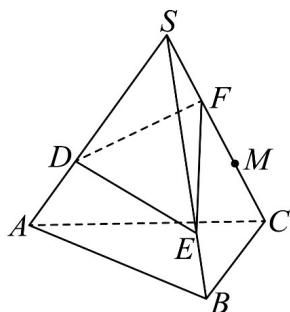

> [!faq]- 《专题8.3 简单几何体的表面积与体积（高效培优讲义）》官方解析
>
> > [!success]- **【答案】** $\frac{23}{27}$
>
> > [!note]- **【分析】**
> > 要使容器盛水最多，水面只能与平面 DEM 平行，所以所装水体积就是几何体 DEM-ABC 的体积，
> >
> > 结合棱锥的性质得出·
>
> > [!note]- **【解析】**
> > 如图，因 $CF:FS = 2:1$ ，则 $CS:FS = 3:1$ ，又因为 $SD:DA = SE:EB = 2:1$
> >
> > 得VSDE与△SAB相似，所以 $\frac{S_{\triangle SDE}}{S_{\triangle SAB}} = \frac{4}{9}$
> >
> > 设 $F, C$ 点到平面 $SAB$ 的距离分别为 $h_1, h_2$ ，则 $\frac{h_1}{h_2} = \frac{1}{3}$ .
> >
> > 要使容器盛水最多，水面只能与平面 DEM 平行，
> >
> > 所以所装水体积就是几何体 DEM-ABC 的体积.
> >
> > 
> >
> > 所以 $\frac{V_{F - SDE}}{V_{C - SAB}} = \frac{\frac{1}{3}S_{\triangle SDE}h_1}{\frac{1}{3}S_{\triangle SAB}h_2} = \frac{4}{9}\times \frac{1}{3} = \frac{4}{27}$ ，得 $\frac{V_{DEF - ABC}}{V_{C - SAB}} = 1 - \frac{V_{F - SDE}}{V_{C - SAB}} = 1 - \frac{4}{27} = \frac{23}{27}$
> >
> > 故答案为： $\frac{23}{27}$
> >
> > ## 方法技巧
> >
> > 求棱柱、棱锥、棱台体积的注意事项
> >
> > 1、常见的求几何体体积的方法
> > - **①**：公式法：直接代入公式求解．② 等积法：如四面体的任何一个面都可以作为底面，只需选用底面积和高都
> >
> > 易求的形式即可．③分割法：将几何体分割成易求解的几部分，分别求体积．
> >
> > 2、求几何体体积时需注意的问题
> >
> > 柱、锥、台的体积的计算，一般要找出相应的底面和高，要充分利用截面、轴截面，求出所需要的量，最后
> >
> > 代入公式计算.
