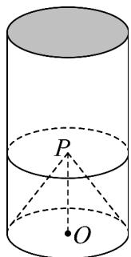

<!-- question-source:start -->
【变式1】如图所示，某建筑物模型无下底面，有上底面，其外观是圆柱，底部挖去一个圆锥·已知圆柱与圆

锥的底面大小相同，圆柱的底面半径为 $6\mathrm{cm}$ ，高为 $20\mathrm{cm}$ ，圆锥母线为 $10\mathrm{cm}$ 。

(1)计算该模型的体积·(结果精确到 $1cm^{3}$ )

(2)现需使用油漆对400个该种模型进行涂层，油漆费用为每平方米30元，总费用是多少？（结果精确到1

元）
<!-- question-source:end -->

![[高中/课堂同步/题库/人教A版高中数学同步讲义(2026)/02_必修第二册/第八章 立体几何初步/专题8.3 简单几何体的表面积与体积（高效培优讲义）/题型03_圆柱_圆锥_圆台的表面积/questions/answers/Q00069778A1.md]]
