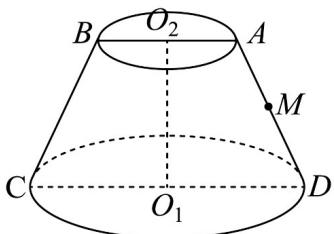

<!-- question-source:start -->
【变式3】如图所示的圆台 $O_{1}O_{2}$ ，圆台的高为 $\sqrt{3}$ ，上底面圆 $O_{2}$ 的半径为 1，下底面圆 $O_{1}$ 的半径为 2，则下列

说法正确的是（）

A. 该圆台轴截面面积为 $3\sqrt{3}$

B．该圆台的表面积为 $6\pi$

C. 该圆台的体积为 $\frac{7\sqrt{3}\pi}{3}$

D．一只蚂蚁从 C 点出发，沿着圆台表面爬行，最终到达 AD 的中点 M 处，则爬行的最短路程为 5
<!-- question-source:end -->

![[高中/课堂同步/题库/人教A版高中数学同步讲义(2026)/02_必修第二册/第八章 立体几何初步/专题8.3 简单几何体的表面积与体积（高效培优讲义）/题型03_圆柱_圆锥_圆台的表面积/questions/answers/Q00069780A1.md]]
