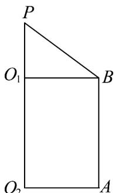
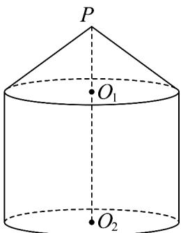

<!-- question-source:start -->
【典例1】如图 $^{1}$ ，在直角梯形 $PO_{2}AB$ 中， $AO_{2}\perp PO_{2}$ ， $BO_{1}\perp PO_{1}$ ．以直角梯形 $PO_{2}AB$ 的下底 $PO_{2}$ 所在的直

线为旋转轴，其余三边旋转一周形成如图2所示的几何体 $\Omega$ （ $\Omega$ 由圆锥 $PO_{1}$ 和圆柱 $O_{1}O_{2}$ 组合而成），且该几

何体 $\Omega$ 内接于半径为5的球 $O$ （点 $P$ 和圆柱 $O_{1}O_{2}$ 的上下底面圆周均在球 $O$ 的球面上）.

图1

图2

(1)若 $AO_{2} = 4$ ，求几何体 $\Omega$ 的体积；

(2)若 $PO_{1}:O_{1}O_{2} = 1:2$ ，求几何体 $\Omega$ 的表面积；

(3)当 $AB$ 为何值时，圆柱 $O_{1}O_{2}$ 的侧面积最大.
<!-- question-source:end -->

![[高中/课堂同步/题库/人教A版高中数学同步讲义(2026)/02_必修第二册/第八章 立体几何初步/专题8.3 简单几何体的表面积与体积（高效培优讲义）/题型03_圆柱_圆锥_圆台的表面积/questions/answers/Q00069986A1.md]]
