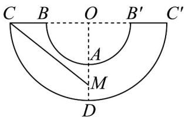

> [!faq]- 《专题8.3 简单几何体的表面积与体积（高效培优讲义）》官方解析
>
> > [!success]- **【答案】** ACD
>
> > [!note]- **【分析】**
> > 利用圆台的表面积公式和体积公式，梯形的面积公式计算即可判断 A，B，C 项；将圆台侧面展开，
> >
> > 利用弧长公式和勾股定理即可求解·
>
> > [!note]- **【解析】**
> > 对于 $^{A}$ ，圆台轴截面为等腰梯形ABCD，其中AB=2,CD=4, $O_{1}O_{2}=\sqrt{3}$
> >
> > 则其面积为： $S_{ABCD}=\frac{1}{2}(2+4)\times\sqrt{3}=3\sqrt{3}$ ，故A正确；
> >
> > 对于 $\mathbf{B}$ ，由图知，圆台的母线长 $AD = \sqrt{(2 - 1)^2 + (\sqrt{3})^2} = 2$
> >
> > 则圆台的表面积为： $\pi\times2^{2}+\pi\times1^{2}+\frac{1}{2}(2\pi\times2+2\pi\times1)\times2=11\pi$ ，故 $^{B}$ 错误；
> >
> > 对于 C，该圆台的体积为 $V=\frac{1}{3}\times\sqrt{3}\times\pi\times(1^{2}+2^{2}+1\times2)=\frac{7\sqrt{3}}{3}\pi$ ，故 C 正确；
> >
> > 
> >
> > 对于 $^{D}$ ，将圆台沿着母线 BC 展开，得到如图的扇环形，由题意，蚂蚁爬行的最短路程为 CM 的长·
> >
> > 因 OC = 2BC = 4，劣弧 CD 的长为 $2\pi$ ，故 $\angle COD$ 的弧度数为 $\frac{2\pi}{4} = \frac{\pi}{2}$ ，
> >
> > 又点 $M$ 是 $AD$ 的中点，故 $OM = 3$ ，由勾股定理， $CM = \sqrt{4^2 + 3^2} = 5$ ，故D正确
> >
> > 故选 **ACD**.
