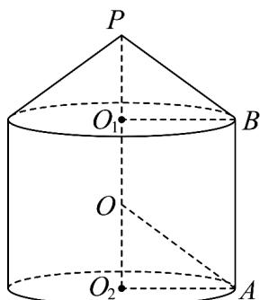

> [!faq]- 《专题8.3 简单几何体的表面积与体积（高效培优讲义）》官方解析
>
> > [!success]- **【答案】** (1) $\frac{320\pi}{3}$ (2) $\frac{75(2\sqrt{3}+1)\pi}{4}$ (3) $5\sqrt{2}$
>
> > [!note]- **【分析】**
> > （1）根据条件知设球心 $O$ 为 $O_{1}O_{2}$ 的中点，结合题设条件求出 $O_{1}O_{2},PO_{1}$ ，再利用圆柱和圆锥的体积
> >
> > 公式，即可求解；
> >
> > (2) 设 $PO_{1} = a, O_{1}O_{2} = 2a$ ，根据条件得到 $a = \frac{5}{2}$ ，进而求出 $AO_{2}, PB$ ，再利用圆柱和圆锥的表面积公式，即
> >
> > 可求解；
> >
> > (3) 设 AB = x ，根据条件得圆柱 $O_{1}O_{2}$ 的侧面积为 $S_{3} = 2\pi x \sqrt{25 - x^{2}}$ ，利用基本不等式，即可求解
>
> > [!note]- **【解析】**
> > （1）如图，设球心为 $O$ ，由题知 $O$ 为 $O_{1}O_{2}$ 的中点，且 $OA = OB = OP = R$ （其中 $R$ 为外接球的半
> >
> > 径），
> >
> > 又球 $O$ 半径为5， $AO_{2} = 4$ ，则 $OO_{2} = \sqrt{OA^{2} - O_{2}A^{2}} = \sqrt{5^{2} - 4^{2}} = 3$
> >
> > 所以 $O_{1}O_{2}=6, PO_{1}=5-3=2$ ，则圆柱 $O_{1}O_{2}$ 的体积为 $V_{1}=\pi\times4^{2}\times6=96\pi$ ，圆锥 $PO_{1}$ 的体积为
> >
> > $$
> > V _ {2} = \frac {1}{3} \pi \times 4 ^ {2} \times 2 = \frac {3 2 \pi}{3}
> > $$
> >
> > 则几何体 $\Omega$ 的体积 $V = V_{1} + V_{2} = 96\pi + \frac{32\pi}{3} = \frac{320\pi}{3}$
> >
> > 
> >
> > (2) 因为 $PO_{1}:O_{1}O_{2}=1:2$ ，不妨设 $PO_{1}=a,O_{1}O_{2}=2a$
> >
> > 由题知 OP = 2a = 5 ，得到 $a = \frac{5}{2}$ ，
> >
> > 则 $AO_{2} = \sqrt{OA^{2} - O_{2}A^{2}} = \sqrt{5^{2} - \left(\frac{5}{2}\right)^{2}} = \frac{5\sqrt{3}}{2}$ ，又 $O_{1}B = O_{2}A = \frac{5\sqrt{3}}{2}$ ，则 $PB = \sqrt{O_1P^2 + O_1B^2} = \sqrt{\frac{25}{4} + \frac{75}{4}} = 5$
> >
> > 所以圆柱 $O_{1}O_{2}$ 的表面积为 $S_{1} = \pi O_{2}A^{2} + 2\pi O_{2}A\cdot O_{1}O_{2} = \pi \times \frac{75}{4} +2\pi \times \frac{5\sqrt{3}}{2}\times 5 = 25\sqrt{3}\pi +\frac{75\pi}{4}$
> >
> > 圆锥 $PO_{1}$ 的表面积为 $S_{2}=\pi O_{1}B\cdot PB=\pi\times\frac{5\sqrt{3}}{2}\times5=\frac{25\sqrt{3}\pi}{2}$
> >
> > 所以几何体 $\Omega$ 的表面积为 $S = S_{1} + S_{2} = \frac{75\sqrt{3}\pi}{2} + \frac{75\pi}{4} = \frac{75(2\sqrt{3} + 1)\pi}{4}$ .
> >
> > (3) 设 AB = x，则 $O_{2}A = \sqrt{25 - \frac{x^{2}}{4}}$
> >
> > 则圆柱 $O_{1}O_{2}$ 的侧面积为 $S_{3} = 2\pi O_{2}A\cdot AB = 2\pi x\sqrt{25 - \frac{x^{2}}{4}} = \pi x\sqrt{100 - x^{2}}\leq \pi \times \frac{x^{2} + 100 - x^{2}}{2} = 50\pi$
> >
> > 当且仅当 $x^{2} = 100 - x^{2}$ ，即 $x = 5\sqrt{2}$ 时取等号，即当 $x = 5\sqrt{2}$ 时，圆柱 $O_{1}O_{2}$ 的侧面积最大
> >
> > ## 方法技巧
> >
> > ## 求旋转体表面积注意事项
> >
> > 旋转体中，求面积应注意侧面展开图，上下面圆的周长是展开图的弧长．圆台通常还要还原为圆锥．
