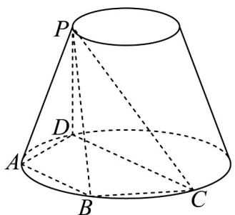

<!-- question-source:start -->
【变式1】如图，四边形ABCD是圆台下底面圆的内接四边形， $AB = AD = 4$ ， $C$ 为底面圆周上一动点，

$\angle BCD = \frac{\pi}{3}$ ， $PA$ 为圆台的母线， $PA = 5$ ，圆台上底面的半径为1，则该圆台的表面积为\_\_\_\_，四棱锥

P-ABCD 的体积的最大值为 \_\_\_\_ .

<!-- question-source:end -->

![[高中/课堂同步/题库/人教A版高中数学同步讲义(2026)/02_必修第二册/第八章 立体几何初步/专题8.3 简单几何体的表面积与体积（高效培优讲义）/题型04_圆柱_圆锥_圆台的体积/questions/answers/Q00069781A1.md]]
