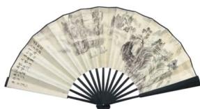
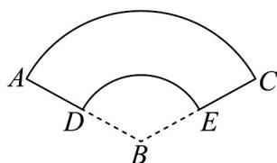

<!-- question-source:start -->
【变式2】折扇是我国古老文化的延续，在我国已有四千年左右的历史，“扇”与“善”谐音，折扇也寓意“善良”

“善行”，它常以字画的形式体现我国的传统文化，也是运筹帷幄、决胜千里、大智大勇的象征(如图①)，图②

是一个圆台的侧面展开图(扇形的一部分)，若两个圆弧 $\overrightarrow{DE}$ 、 $\overrightarrow{AC}$ 所在圆的半径分别是 $^{3}$ 和 $^{6}$ ，且 $\angle ABC=120^{\circ}$ ，

则下列关于该圆台的说法正确的是（）

图①

图②

A. 高为 $2\sqrt{2}$ B. 母线长为3

C．表面积为 $14\pi$ D．体积为 $\frac{16\sqrt{2}}{3}\pi$
<!-- question-source:end -->

![[高中/课堂同步/题库/人教A版高中数学同步讲义(2026)/02_必修第二册/第八章 立体几何初步/专题8.3 简单几何体的表面积与体积（高效培优讲义）/题型04_圆柱_圆锥_圆台的体积/questions/answers/Q00069782A1.md]]
