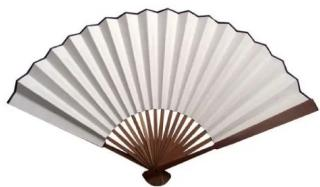
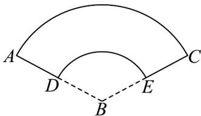

<!-- question-source:start -->
【变式3】荣昌折扇是国家级非物质文化遗产之一，其始于北宋年间，以楠竹和皮纸为原料，经青山、风骨、

皂锅、棕风、坯子、纸口、头子、梳练、扇糊、折扇、捆扎、白扇页、角告、扇箱、书画、装运等传统工序

手工精制而成，具有很高的艺术和收藏价值（图1）．图2是一个扇形面，其对应一个圆台的侧面展开图，

若此扇形面的两个圆弧所在圆的半径分别是 $^{1}$ 和 $^{3}$ ，且 $\angle ABC = 120^{\circ}$ ，则该圆台（）

图1
图2

A. 高为 $\frac{2\sqrt{2}}{3}$ B. 表面积为 $\frac{34\pi}{9}$

C．体积为 $\frac{52\sqrt{2}}{81}\pi$ D．上底面积、下底面积和侧面积之比为1:9:24
<!-- question-source:end -->

![[高中/课堂同步/题库/人教A版高中数学同步讲义(2026)/02_必修第二册/第八章 立体几何初步/专题8.3 简单几何体的表面积与体积（高效培优讲义）/题型04_圆柱_圆锥_圆台的体积/questions/answers/Q00069783A1.md]]
