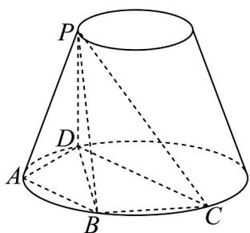

> [!faq]- 《专题8.3 简单几何体的表面积与体积（高效培优讲义）》官方解析
>
> > [!success]- **【答案】** $42\pi$ $\frac{64\sqrt{3}}{3} / \frac{64}{3}\sqrt{3}$
>
> > [!note]- **【分析】**
> > 在 $\triangle ABD$ 中，先利用余弦定理求出 $BD$ ，再利用正弦定理求出外接圆的半径 $R$ ，再根据圆台的表面
> >
> > 积公式求解即可；在 $\triangle BCD$ 中，由余弦定理先求出 $BC \cdot CD$ 的最大值，进而得到 $\triangle BCD$ 及底面 $ABCD$ 面积的
> >
> > 最大值，即可求出四棱锥 P-ABCD 的体积的最大值·
>
> > [!note]- **【解析】**
> > 
> >
> > 如图，连接BD·
> >
> > 因为 $\angle BCD = \frac{\pi}{3}$ ，所以 $\angle BAD = \frac{2\pi}{3}$
> >
> > 在 $\triangle ABD$ 中，由余弦定理可得
> >
> > $$
> > B D ^ {2} = A B ^ {2} + A D ^ {2} - 2 A B \cdot A D \cdot \cos \angle B A D
> > $$
> >
> > $$
> > = 4 ^ {2} + 4 ^ {2} - 2 \times 4 \times 4 \times \cos 1 2 0 ^ {\circ} = 4 8
> > $$
> >
> > 所以 $BD = 4\sqrt{3}$ .
> >
> > 由正弦定理可知外接圆的直径
> >
> > $$
> > 2 R = \frac {B D}{\sin \angle B A D} = \frac {4 \sqrt {3}}{\frac {\sqrt {3}}{2}} = 8
> > $$
> >
> > 所以圆台的下底面半径 $R = 4$ ，上底面半径 $r = 1$
> >
> > 圆台的侧面积 $S_{\text{侧}} = \pi (r + R)l = \pi \times 5 \times 5 = 25\pi$
> >
> > 上底面面积 $S_{\text{上}} = \pi r^2 = \pi$ ，下底面面积 $S_{\text{下}} = \pi \mathrm{R}^2 = 16\pi$
> >
> > 所以圆台的表面积 $S_{表} = 25\pi + \pi + 16\pi = 42\pi$ .
> >
> > 在四边形ABCD中，
> >
> > $$
> > S _ {\triangle A B D} = \frac {1}{2} A B \cdot A D \cdot \sin \angle B A D = \frac {1}{2} \times 4 \times 4 \times \frac {\sqrt {3}}{2} = 4 \sqrt {3}
> > $$
> >
> > 在 $\triangle BCD$ 中，由余弦定理可知 $BD^{2} = BC^{2} + CD^{2} - 2BC\cdot CD\cdot \cos \angle BCD$
> >
> > 即 $BD^{2} = BC^{2} + CD^{2} - BC\cdot CD$ $2BC\cdot CD - BC\cdot CD = BC\cdot CD$
> >
> > 所以 $BC \cdot CD \leq 48$ ，当且仅当 $BC = CD = 4\sqrt{3}$ 时等号成立，
> >
> > 所以 $\triangle BCD$ 的面积 $S = \frac{1}{2} BC\cdot CD\cdot \sin \angle BCD\leq 12\sqrt{3}$
> >
> > 即底面 $ABCD$ 面积的最大值为 $16 \sqrt{3}$
> >
> > 四棱锥 $P - ABCD$ 的高 $h = \sqrt{5^2 - (4 - 1)^2} = 4$
> >
> > 所以四棱锥 $P - ABCD$ 的体积的最大值为 $\frac{1}{3} S_{ABCD} \cdot h = \frac{64\sqrt{3}}{3}$
> >
> > 故答案为 $42\pi$ ； $\frac{64\sqrt{3}}{3}$
