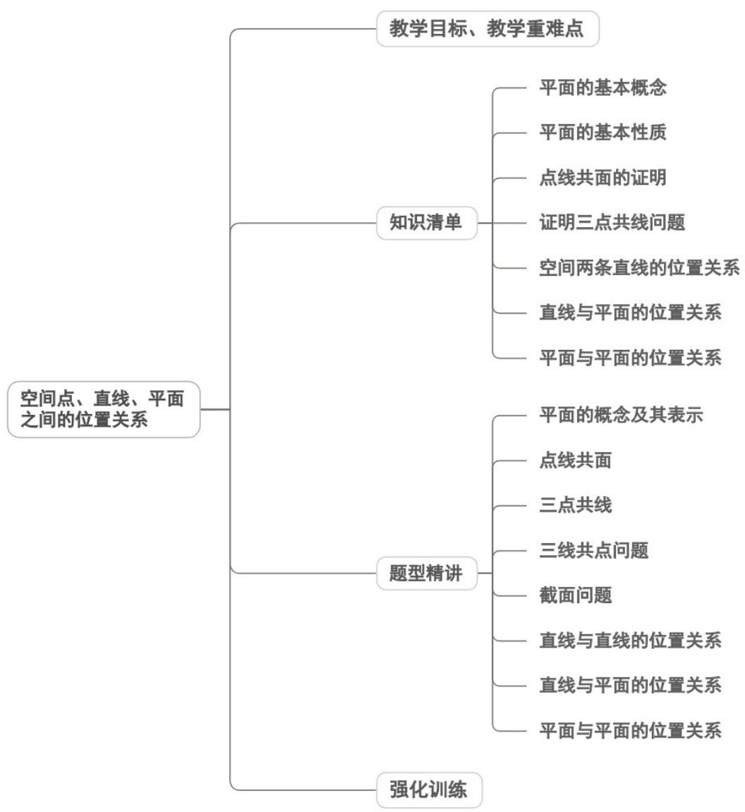
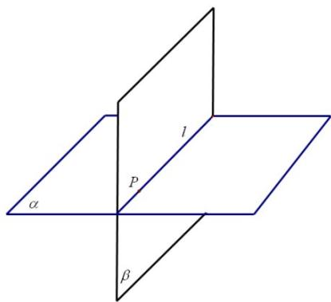
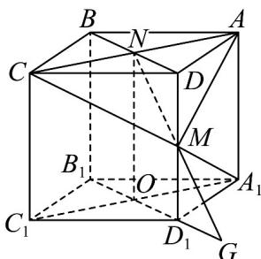
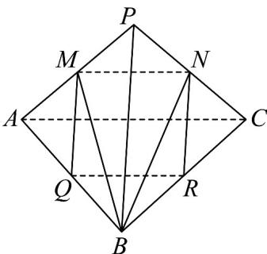
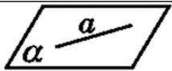
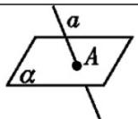
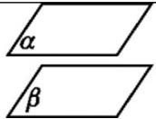
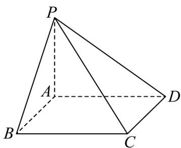

<!-- source-part:1 pages:1-50 -->

## 专题 8.4 空间点、直线、平面之间的位置关系

## 内容概览

## 教学目标、教学重难点

<table><tr><td>教学目标</td><td>1.理解平面的抽象概念及“平”“无限延展”的核心特征,掌握平面的图形表示(平行四边形直观图)和符号表示(希腊字母α、β、γ或顶点字母)。2.掌握平面的三个基本事实及三个推论,能准确用文字、图形、符号三种语言表述,明确其在确定平面、判断线面关系中的作用。3.全面认识空间中直线与直线(相交、平行、异面)、直线与平面(在平面内、相交、平行)、平面与平面(平行、相交)的位置关系,能根据交点个数判断位置关系,并熟练用图形和符号语言表示。4.初步学会运用基本事实及推论解决简单的空间作图和说理问题,如证明共面问题、判断直线是否在平面内等。</td></tr><tr><td>教学重难点</td><td>1.重点空间中直线与直线、直线与平面、平面与平面的位置关系分类及判定,核心是根据“公共点个数”和“共面性”进行准确区分。2.难点异面直线的概念理解与判定,学生常将异面直线与“不相交直线”“分别在两个平面内的直线”混淆,难以把握“不同在任何一个平面内”的核心内涵。</td></tr></table>

## 知识清单

## 知识点 01 平面的基本概念

1、平面的概念：“平面”是一个只描述而不定义的原始概念，常见的桌面、黑板面、平静的水面等都给我们以

平面的形象．几何里的平面就是从这些物体中抽象出来的，但是，几何里的平面是无限延展的．

## 知识点诠释：

(1) “平面”是平的（这是区别“平面”与“曲面”的依据）；

(2) “平面”无厚薄之分；

(3) “平面”无边界，它可以向四周无限延展，这是区别“平面”与“平面图形”的依据。

2、平面的画法：

通常画平行四边形表示平面.

知识点诠释：

（1）表示平面的平行四边形，通常把它的锐角画成 $45^{\circ}$ ，横边长是其邻边的两倍；

(2) 两个相交平面的画法：当一个平面的一部分被另一个平面遮住时，把被遮住的部分的线段画为虚线或者

不画；

3、平面的表示法：

(1) 用一个希腊字母表示一个平面，如平面 $\alpha$ 、平面 $\beta$ 、平面 $\gamma$ 等；

（2）用表示平面的平行四边形的四个字母表示，如平面 $ABCD$ ；

（3）用表示平面的平行四边形的相对两个顶点的两个字母表示，如平面 $AC$ 或者平面 $BD$ ；

4、点、直线、平面的位置关系：

（1）点 $A$ 在直线 $a$ 上，记作 $A \in a$ ；点 $A$ 在直线 $a$ 外，记作 $A \notin a$ ；

(2) 点 A 在平面 $\alpha$ 上，记作 $A \in \alpha$ ；点 A 在平面 $\alpha$ 外，记作 $A \notin \alpha$ ；

(3) 直线 $l$ 在平面 $\alpha$ 内，记作 $l \subset \alpha$ ；直线 $l$ 不在平面 $\alpha$ 内，记作 $l \notin \alpha$ 。

【即学即练】

1. 已知点 $P$ 在直线 $l$ 上，直线 $l$ 在平面 $\alpha$ 内，但不在平面 $\beta$ 内，下列符号表示点、线、面的关系正确的是（）A. $P \subset l$ B. $P \subset \alpha$ C. $l \subset \alpha$ D. $l \notin \beta$

【答案】C
【分析】根据点、线、面位置关系的表示方法进行判断即可·
【详解】因为点 $P$ 在直线 $l$ 上可表示为 $P \in l$ ，故A错误；
直线 $l$ 在平面 $\alpha$ 内，可表示为 $l \subset \alpha$ ，故C正确；
因为 $P \in l$ ， $l \subset \alpha$ ，所以 $P \in \alpha$ ，故B错误；
直线 $l$ 不在平面 $\beta$ 内，可表示为 $l \notin \beta$ ，故D错误·

故选：C

2. 用符号语言表述“若直线 $l$ 在平面 $\alpha$ 内，则直线 $l$ 上的一点 $A$ 必在平面 $\alpha$ 内”，正确的是（） $\left.\begin{array}{l}l\subset\alpha\\A.A\in l\end{array}\right\}\Rightarrow A\in\alpha\quad\left.\begin{array}{l}l\in\alpha\\B.A\in l\end{array}\right\}\Rightarrow A\subset\alpha$ $\left.\begin{array}{l}l\subset\alpha\\C.A\subset l\end{array}\right\}\Rightarrow A\subset\alpha\quad\left.\begin{array}{l}l\in\alpha\\D.A\subset l\end{array}\right\}\Rightarrow A\in\alpha$

【答案】A

【分析】根据给定条件，利用点与线、线与面、点与面的关系的集合表示，逐项判断·

【详解】由直线 $l$ 在平面 $\alpha$ 内，得 $l \subset \alpha$ ；由点 $A$ 在直线 $l$ 上，得 $A \in l$ ；由点 $A$ 在平面 $\alpha$ 内，得 $A \in \alpha$

选项 A 正确，选项 BCD 都错.

故选：A

## 知识点 02 平面的基本性质

平面的基本性质即书中的三个公理，它们是研究立体几何的基本理论基础。

1、公理1：

（1）文字语言表述：如果一条直线上的两点在一个平面内，那么这条直线上所有的点都在这个平面内；

(2) 符号语言表述： $A \in l$ ， $B \in l$ ， $A \in \alpha$ ， $B \in \alpha \Rightarrow l \subset \alpha$ ；

(3) 图形语言表述：

知识点诠释：公理1是判断直线在平面内的依据．证明一条直线在某一平面内，只需证明这条直线上有两个

不同的点在该平面内．“直线在平面内”是指“直线上的所有点都在平面内”.

2、公理2：

（1）文字语言表述：过不在一条直线上的三点，有且只有一个平面；

(2) 符号语言表述：A、B、C三点不共线⇒有且只有一个平面α，使得 $A\in\alpha$ ， $B\in\alpha$ ， $C\in\alpha$ ；

(3) 图形语言表述：

知识点诠释：公理2的作用是确定平面，是把空间问题化归成平面问题的重要依据。它还可用来证明“两个平

面重合”. 特别要注意公理 2 中“不在一条直线上的三点”这一条件.

“有且只有一个”的含义可以分开来理解。“有”是说明“存在”，“只有一个”说明“唯一”，所以“有且只有一个”也可

以说成“存在”并且“唯一”，与确定同义。

(4) 公理 2 的推论：

①过一条直线和直线外一点，有且只有一个平面；

②过两条相交直线，有且只有一个平面；

③过两条平行直线，有且只有一个平面。

(5) 作用：确定一个平面的依据。

3、公理3：

(1) 文字语言表述：如果两个不重合的平面有一个公共点，那么它们有且只有一条过该点的公共直线；

(2) 符号语言表述： $P \in \alpha \cap \beta \Rightarrow \alpha \cap \beta = l$ 且 $P \in l$ ;

(3) 图形语言表述：

知识点诠释：公理3的作用是判定两个平面相交及证明点在直线上的依据.

【即学即练】

1. 已知空间有 $6$ 个不同的平面，则它们的交线条数最多为（）

【答案】
A. 15    B. 16    C. 17    D. 18

【答案】A

【分析】先分析出当这 $^{6}$ 个平面任意 $^{2}$ 个都相交，且交线不重合时，交线最多，再分步计算有多少条交线即

可·

【详解】当这 $^{6}$ 个平面任意 $^{2}$ 个都相交，且交线不重合时，交线最多，

记这 $^{6}$ 个不同的平面分别为 $\alpha_{i}(i=1,2,3,4,5,6)$

此时 $\alpha_{1}$ 与其余 $^{5}$ 个平面相交，有 $^{5}$ 条交线， $\alpha_{2}$ 与除去 $\alpha_{1}$ 外的 $^{4}$ 个平面相交有 $^{4}$ 条交线， $\mathsf{L}$ ， $\alpha_{5}$ 与 $\alpha_{6}$ 相交有

1条交线，

所以共有 $5+4+3+2+1=15$ 条交线.

故选：A.

2. 已知正方体 $ABCD - A_{1}B_{1}C_{1}D_{1}$ 中，点 $M$ 为线段 $D_{1}B_{1}$ 上的动点，点 $N$ 为线段 $AC$ 上的动点，则与线段 $DB_{1}$ 相交且互相平分的线段 $MN$ 有 \_\_\_\_ 备：

交且互相平分的线段 $MN$ 有 \_\_\_\_ 条·

【答案】 $^{1}$

【分析】根据给定条件，利用平面的基本事实确定点 $N$ 的位置，再作图确定 $M$ 的位置作答

【详解】在正方体 $ABCD - A_{1}B_{1}C_{1}D_{1}$ 中， $M \in D_{1}B_{1}$ ，而 $D_{1}B_{1} \subset$ 平面 $D_{1}B_{1}D$ ，即有 $M \in$ 平面 $D_{1}B_{1}D$

又 $MN$ 与线段 $DB_{1}$ 相交，则交点必在直线 $DB_{1}$ 上，而 $DB_{1} \subset$ 平面 $D_{1}B_{1}D$ ，于是 $MN \subset$ 平面 $D_{1}B_{1}D$ ， $N \in$ 平面 $D_{1}B_{1}D$

而 $N \in AC$ ， $AC \subset$ 平面 $ABCD$ ，即 $N \in$ 平面 $ABCD$ ，而平面 $D_{1}B_{1}D \cap$ 平面 $ABCD = BD$

因此 $N \in BD$ ，即点 $N$ 为 $AC, BD$ 的交点 $O$ ，又线段 $DB_{1}$ 与 $MN$ 互相平分，

取 $DB_{1}$ 的中点 $E$ ，连接 $OE$ 并延长交 $D_{1}B_{1}$ 于 $O_{1}$ ，显然 $EO //BB_{1} //DD_{1}$ ，于是 $O_{1}$ 为 $D_{1}B_{1}$ 的中点，

所以当点 N 与 O 重合，点 M 与 $O_{1}$ 重合时，MN 与线段 $DB_{1}$ 相交且互相平分，这样的直线 MN 只有 $^{1}$ 条·

故答案为：1

## 知识点 03 点线共面的证明

所谓点线共面问题就是指证明一些点或直线在同一个平面内的问题.

1、证明点线共面的主要依据：

（1）如果一条直线上的两点在一个平面内，那么这条直线上的所有点都在这个平面内（公理1）；②经过不

在同一条直线上的三点，有且只有一个平面（公理2及其推论）.

2、证明点线共面的常用方法：

(1) 证明几点共面的问题可先取三点（不共线的三点）确定一个平面，再证明其余各点都在这个平面内；

（2）证明空间几条直线共面问题可先取两条（相交或平行）直线确定一个平面，再证明其余直线均在这个平

面内.

## 【即学即练】

1．正方体 $ABCD-A_{1}B_{1}C_{1}D_{1}$ 棱长为 2，N 为线段 AC 上一动点，M 为线段 $DD_{1}$ 上一动点，则 $A_{1}M+MN$ 的最小

值为\_\_\_\_。

【答案】 $\sqrt{10 + 4\sqrt{2}} / \sqrt{4\sqrt{2} + 10}$

【分析】先明确 $MN$ 最小值情况，进而得到 $MN$ 最小时 $MN$ 位置，然后把空间两根线段和 $A_{1}M + MN$ 等价转化

成共面的两根线段和 $GM + MN$ 即可求解.

【详解】如图，连接 MC，MA，

则由题意可知当 $\triangle MCA$ 为等腰三角形，当 $MN$ 垂直于 $AC$ 时 $MN$ 最短，

此时 N 为 AC 中点， $MN \subset$ 面 $DD_{1}B_{1}B$

如图延长 $B_{1}D_{1}$ 至G，使得 $D_{1}G=D_{1}A_{1}$ ，连接GM，

则 $MG \subset$ 面 $DD_{1}B_{1}B$ ，且 $GM = A_{1}M$

所以 $M, G, N \subset$ 面 $DD_{1}B_{1}B$ ，故当三点共线时 $A_{1}M + MN = GM + MN$ 最小，

此时 $A_{1}M + MN = GM + MN = \sqrt{ON^{2} + OG^{2}} = \sqrt{2^{2} + (2 + \sqrt{2})^{2}} = \sqrt{10 + 4\sqrt{2}}$

故答案为： $\sqrt{10+4\sqrt{2}}$

2. 下列四个命题中为真命题的是（ ）

【答案】
A．过空间中任意三点有且仅有一个平面
B．两两相交且不过同一点的三条直线必在同一平面内
C．若空间两条直线不相交，则这两条直线平行
D．空间四点不共面，则任意三点不共线

【答案】BD

【分析】当三点在一条直线上时，过这三点有无数个平面可判断 $^{A}$ ；由平面的性质可判断BD；

由空间两条直线的位置关系可判断 C.

【详解】对于 $A$ ，当三点在一条直线上时，过这三点有无数个平面，错误；

对于 $^{B}$ ，两两相交且不过同一点的三条直线必在同一平面内，正确；

对于 $^{C}$ ，若空间两条直线不相交，则这两条直线平行或异面，错误；

对于 D，空间四点不共面，则任意三点不共线，正确·故选：BD.

知识点 04 证明三点共线问题

所谓点共线问题就是证明三个或三个以上的点在同一条直线上.

1、证明三点共线的依据是公理3：如果两个不重合的平面有一个公共点，那么它们还有其他的公共点，且所

有这些公共点的集合是一条过这个公共点的直线．也就说一个点若是两个平面的公共点，则这个点在这两个

平面的交线上.

对于这个公理应进一步理解下面三点：①如果两个相交平面有两个公共点，那么过这两点的直线就是它们的

交线；②如果两个相交平面有三个公共点，那么这三点共线；③如果两个平面相交，那么一个平面内的直线

和另一个平面的交点必在这两个平面的交线上.

2、证明三点共线的常用方法

方法1：首先找出两个平面，然后证明这三点都是这两个平面的公共点．根据公理3知，这些点都在交线上．

方法2：选择其中两点确定一条直线，然后证明另一点也在其上。

【即学即练】

1. 如图所示， $AB \cap \alpha = P$ ， $CD \cap \alpha = P$ ， $A$ ， $D$ 与 $B$ ， $C$ 分别在平面 $\alpha$ 的两侧， $AC \cap \alpha = Q$ ， $BD \cap \alpha = R$

求证：P，Q，R三点共线·

【答案】证明见解析

【分析】推导出 P 、 Q 、 R 是平面 $\alpha$ 与平面 ACBD 的公共点，由此能证明 P ， Q ， R 三点共线．

【详解】证明：∵ $AB \cap \alpha = P$ ， $CD \cap \alpha = P$ ，A，D 与 B，C 分别在平面 $\alpha$ 的两侧，

$\therefore AB \cap CD = P$ ， $\therefore A, C, B, D$ 构成一个平面，

∵ $AC \cap \alpha = Q$ ， $BD \cap \alpha = R$ ， $AB \cap \alpha = P$ ， $CD \cap \alpha = P$ ，∴ P、Q、R 是平面 与平面 ACBD 的公共点，

∴ P 、 Q 、 R 都在平面 α 与平面 ACBD 的交线上，∴ P 、 Q 、 R 三点共线．

2. 在长方体 $ABCD - A_{1}B_{1}C_{1}D_{1}$ 中， $M$ 是 $A_{1}C_{1}$ 和 $B_{1}D_{1}$ 的交点， $B_{1}D$ 与平面 $A_{1}BC_{1}$ 交于点 $N$ .

(1)证明： $B,N,M$ 三点共线·

(2)若 $AB = BC = 4, BB_{1}$ 为长方体 $ABCD - A_{1}B_{1}C_{1}D_{1}$ 的一条高且， $BB_{1} = 6$ ，求四棱锥 $N - ABCD$ 的体积.

【答案】(1)证明见解析

(2) $\frac{64}{3}$ .

【分析】（1）证明 $N \in$ 平面 $BB_{1}D_{1}D$ ，又 $N \in$ 平面 $A_{1}BC_{1}$ ，平面 $BB_{1}D_{1}D \cap$ 平面 $A_{1}BC_{1} = BM$ ，可证 B，N，M

三点共线.

(2) 连接 BD，可得 $ON = \frac{2}{3} BB_{1} = 4$ ，可求四棱锥 N - ABCD 的体积。

【详解】（1）因为 $N \in B_{1}D, B_{1}D \subset$ 平面 $BB_{1}D_{1}D$

所以 $N \in$ 平面 $BB_{1}D_{1}D$

又 $N \in$ 平面 $A_{1}BC_{1}$ ，平面 $BB_{1}D_{1}D \cap$ 平面 $A_{1}BC_{1} = BM$

所以 $N \in BM$

即 $B, N, M$ 三点共线·

(2) 连接 BD，则 $\triangle B_{1}MN$ 与 $\triangle DBN$ 相似，

所以 $\frac{B_1N}{DN} = \frac{B_1M}{DB} = \frac{1}{2}$

所以 $DN = \frac{2}{3} DB_{1}$

在 $\triangle BDB_{1}$ 中，作 $NO//BB_{1}$ ，交 $DB$ 于点 $O$ ，则 $ON = \frac{2}{3} BB_{1} = 4$

所以 $V_{N-ABCD}=\frac{1}{3}\times4\times4\times4=\frac{64}{3}$

## 知识点 05 空间两条直线的位置关系

<table><tr><td>位置关系</td><td>共面情况</td><td>有无公共点</td></tr><tr><td>相交</td><td>在同一平面内</td><td>有且只有一个公共点</td></tr><tr><td>平行</td><td>在同一平面内</td><td>没有公共点</td></tr><tr><td>异面</td><td>不同在任何一个平面内</td><td>没有公共点</td></tr></table>

## 【即学即练】

1. 如图，已知正四面体 $P - ABC$ ， $M, N, Q, R$ 分别是棱 $PA, PC, AB, BC$ 的中点。

(1)证明：四边形 $MNRQ$ 为菱形；

(2)求异面直线 BM 与 QR 所成角的余弦值.

【答案】(1)证明见解析；

(2) $\frac{\sqrt{3}}{6}$ .

【分析】（1）利用中位线即可求证四边形 $MNRQ$ 为平行四边形，再求证 $MQ = MN$ 即可；

(2) 根据异面直线所成角的定义找出 $\angle BMN$ 或其补角为所求角，在 $\triangle MNB$ 中利用余弦定理求得 $\cos \angle BMN$ 即

可·

【详解】（1）由题知，MN 为 $\triangle PAC$ 的中位线，QR 是 VABC 的中位线，

所以 $MN//AC$ ，且 $MN = \frac{1}{2} AC$ ， $QR//AC$ ，且 $QR = \frac{1}{2} AC$

故 $MN // QR$ ，且 $MN = QR$ ，故四边形 $MNRQ$ 为平行四边形，

又 MQ 是 $\triangle PAB$ 的中位线，则 $MQ = \frac{1}{2} PB$ ，

因为在正四面体中， $PB = AC$ ，所以 $MQ = MN$ ，故四边形 $MNRQ$ 为菱形.

(2) 因为 $QR // MN$ ，所以 $\angle BMN$ 或其补角为异面直线 $BM$ 与 $QR$ 所成的角，

设正四面体的棱长为 $2a$ ，则 $BM = BN = \sqrt{3} a$ ， $MN = a$ 在 $\triangle MNB$ 中，利用余弦定理得， $\cos \angle BMN = \frac{a^2 + (\sqrt{3}a)^2 - (\sqrt{3}a)^2}{2 \times a \times \sqrt{3}a} = \frac{\sqrt{3}}{6}$ ，故异面直线 $BM$ 与 $QR$ 所成角的余弦值为 $\frac{\sqrt{3}}{6}$ 。

2. 在正方体 $ABCD - A_{1}B_{1}C_{1}D_{1}$ 中， $E$ 为棱 $DD_{1}$ 的中点，异面直线 $BE$ 与 $AD_{1}$ 所成的角为（）A. $\frac{\pi}{6}$ B. $\frac{\pi}{4}$ C. $\frac{\pi}{3}$ D. $\frac{\pi}{2}$

【答案】B

【分析】根据异面直线的定义找到对应的平面角，应用余弦定理求其大小即可·

【详解】由题设 $AB // C_1 D_1$ 且 $AB = C_1 D_1$ ，即四边形 $ABC_1 D_1$ 为平行四边形，故 $AD_1 // BC_1$ ，所以异面直线 $BE$ 与 $AD_1$ 所成角，即为直线 $BE$ 与 $BC_1$ 所成的角 $\angle EBC_1$ 或其补角，

设正方体棱长为 $^{2}$ ，则 $BC_{1}=2\sqrt{2}, BE=3, EC_{1}=\sqrt{5}$ ，故 $\cos\angle EBC_{1}=\frac{8+9-5}{2\times2\sqrt{2}\times3}=\frac{\sqrt{2}}{2}$

结合异面直线夹角的范围知，异面直线 BE 与 $AD_{1}$ 所成角为 $\frac{\pi}{4}$

故选：B

知识点 06 直线与平面的位置关系

<table><tr><td>位置关系</td><td>图形表示</td><td>符号表示</td><td>公共点</td></tr><tr><td>直线a在平面α内</td><td></td><td>a⊂α</td><td>有无数个公共点</td></tr><tr><td>直线a与平面α相交</td><td></td><td>a∩α=A</td><td>有且只有一个公共点</td></tr><tr><td>直线a与平面α平行</td><td></td><td>a//α</td><td>无公共点</td></tr></table>

## 【即学即练】

1. 已知直线 $l$ ， $A$ 为直线 $l$ 外一点，下列叙述中正确的是（）·

①过点 A 有且只有一条直线与 l 平行；

②过点 A 有且只有一个平面与 l 平行；

③过点 A 有且只有一条直线与 l 垂直；

④过点 A 有且只有一个平面与 l 垂直.
A. ①④ B. ①③ C. ②④ D. ②③

【答案】A

【分析】根据直线，平面间的位置关系逐项判断即可·

【详解】直线 $l$ ， $A$ 为直线 $l$ 外一点，所以过点 $A$ 有且只有一条直线与 $l$ 平行；过点 $A$ 有无数个平面与 $l$ 平行；

过点 A 有无数条直线与 l 垂直；过点 A 有且只有一个平面与 l 垂直，

所以②③错误，①④正确，

故选：A.

2．如图，在四棱锥 P-ABCD 中，底面 ABCD 是边长为 $^{4}$ 的正方形，侧面 PAD 是正三角形，侧面 PAD⊥底

面 $ABCD$ ， $E$ 为棱 $PD$ 的中点，平面 $ABE$ 与棱 $PC$ 交于点 $F$ ：

(1)求证： $F$ 为棱 $PC$ 的中点；

(2)求直线 BF 与平面 ABCD 所成角的正切值.

【答案】 $^{(1)}$ 证明见解析

(2) $\frac{\sqrt{39}}{13}$

【分析】（1）因为 E 是 PD 的中点，若证明 $CD \parallel EF$ ，那么即可证明 F 是 PC 的中点。

(2) 首先确定 $\angle FBH$ 为直线 BF 与平面 ABCD 所成的角，然后根据线段、角度的关系求出其正切值.

【详解】（1）因为四边形ABCD为正方形，所以 $CD \parallel AB$

又 $CD \notin$ 平面 ABE ， $AB \subset$ 平面 ABE ，

所以 $CD / /$ 平面ABE.

因为 $CD \subset$ 平面 PCD ，平面 $ABE \cap$ 平面 PCD = EF ，

所以 CD // EF .

因为 E 为棱 PD 的中点，所以 F 为棱 PC 的中点。

(2) 取 AD 的中点为 G，连接 PG, CG，取 CG 的中点为 H，连接 FH, BH

因为 $\triangle PAD$ 为正三角形， $G$ 为棱 $AD$ 的中点，

所以 $PG \perp AD$

又平面 $PAD \perp$ 平面 $ABCD$ ，平面 $PAD \cap$ 平面 $ABCD = AD$ ， $PG \subset$ 平面 $PAD$ ，所以 $PG \perp$ 平面 $ABCD$

因为 F, H 分别为 PC, CG 的中点，

所以 FH 是 $\triangle PCG$ 的中位线，所以 $FH \parallel PG$ ，即 $FH \perp$ 平面 ABCD，

所以 $\angle FBH$ 为直线 BF 与平面 ABCD 所成的角.

在 $\mathrm{Rt}^{\triangle}$ $CDG$ 中， $CG = \sqrt{CD^2 + DG^2} = 2\sqrt{5}$ ，所以 $\cos \angle BCH = \sin \angle DCG = \frac{DG}{CG} = \frac{\sqrt{5}}{5}$

在VBCH中， $BH^{2} = CH^{2} + BC^{2} - 2 \times CH \times BC \times \cos \angle BCH = 5 + 16 - 8 = 13$ ，所以 $BH = \sqrt{13}$

在 Rt△ FBH 中， $FH=\frac{1}{2}PG=\sqrt{3}$

所以 $\tan\angle FBH=\frac{FH}{BH}=\frac{\sqrt{3}}{\sqrt{13}}=\frac{\sqrt{39}}{13}$

$$
\sqrt {3 9}
$$

故直线 $BF$ 与平面 $ABCD$ 所成角的正切值为 13

## 知识点 07 平面与平面的位置关系

<table><tr><td>位置关系</td><td>图形表示</td><td>符号表示</td><td>公共点</td></tr><tr><td>两平面平行</td><td></td><td>α//β</td><td>无公共点</td></tr><tr><td>两平面相交</td><td></td><td>α∩β=l</td><td>有无数个公共点,这些点在一条直线上</td></tr></table>

## 【即学即练】

1. 已知直线 $l, m, n$ 与平面 $\alpha, \beta$ ，下列命题正确的是（）

【答案】

A. 若 $l \perp n, n \perp m$ ，则 $l \perp m$ B. 若 $l \perp \alpha, l // \beta$ ，则 $\alpha \perp \beta$ C. 若 $l // \alpha, l \perp m$ ，则 $m \perp \alpha$ D. 若 $\alpha \perp \beta, \alpha \cap \beta = m, l \perp m$ ，则 $l \perp \beta$

【答案】B

【分析】若 $l \perp n, n \perp m$ ，分析出 $l, m$ 有 $l // m$ 或 $l, m$ 相交或 $l, m$ 异面三种情况，即可判断 A；若 $l // \beta$ ，过 $l$ 做平面 $\gamma$ ，设 $\beta \cap \gamma = m$ ，根据线面平行的性质定理得到 $l // m$ ，进而得到 $m \perp \alpha$ ，再根据面面垂直的判定定理得到 $\alpha \perp \beta$ ，即可判断 B；若 $l // \alpha$ ， $l \perp m$ ，分析出 $m, \alpha$ 有 $m // \alpha$ 或 $m$ 与 $\alpha$ 相交或 $m \subset \alpha$ 三种情况，即可判断 C；若 $\alpha \perp \beta$ $\alpha \cap \beta = m$ ， $l \perp m$ 分 $l \subset \alpha$ 和 $l \notin \alpha$ 两种情况讨论 $l, \beta$ 的位置关系即可判断 D.

【详解】若 $l \perp n, n \perp m$ ，则 $l \parallel m$ 或 l, m 相交或 l, m 异面，故 A 错误；

若 $l / / \beta$ ，则存在过 $l$ 的平面 $\gamma$ ， $\beta \cap \gamma = m$ ，则由线面平行的性质定理可知 $l / / m$ ，

又因为 $l \perp \alpha$ ，所以 $m \perp \alpha$ ，因为 $m \subset \beta$ ，所以 $\alpha \perp \beta$ ，故 B 正确；

若 $l//\alpha$ ， $l\perp m$ ，则 $m//\alpha$ 或m与 $\alpha$ 相交或 $m\subset\alpha$ ，故 $^{C}$ 错误；

若 $\alpha \perp \beta$ ， $\alpha \cap \beta = m$ ， $l\perp m$ ，当 $l\subset \alpha$ 时， $l\perp \beta$

当 $l \notin \alpha$ 时， $l // \beta$ 或 $l$ 与 $\beta$ 相交，或 $l \subset \beta$ ，故D错误；

故选：B

2. 如图，在四棱锥 $P - ABCD$ 中，底面 $ABCD$ 是正方形， $PA \perp$ 底面 $ABCD$ ， $PA = AB = 1 \cdot$ 则二面角 $B - PC - D$

的大小

【答案】 $\frac{2\pi}{3}$

【分析】过 $B$ 作 $BE \perp PC$ 交 $PC$ 于 $E$ ，连接 $DE, BD, AC$ ，由线面垂直的性质结合勾股定理可得 $\triangle PCB \cong \triangle PCD$

则 $DE \perp PC$ ，再根据二面角的定义可知 $\angle BED$ 即为二面角 $B - PC - D$ 的平面角，求 $\angle BED$ 即可·

【详解】如图过 B 作 $BE \perp PC$ 交 PC 于 E，连接 DE, BD, AC

因为 $PA \perp$ 底面 $ABCD$ ， $AB, AD, AC \subset$ 底面 $ABCD$ ，所以 $PA \perp AB$ ， $PA \perp AD$ ， $PA \perp AC$

因为底面 $ABCD$ 是正方形， $AB = AD$

所以由勾股定理可得 $\sqrt{PA^2 + AB^2} = \sqrt{PA^2 + AD^2}$ ，即 $PB = PD$

又 BC = DC ， PC = PC ，所以 $\triangle PCB \cong \triangle PCD$ ，所以 $DE \perp PC$ ，

因为平面 $PBC \cap$ 平面 $PDC = PC$ ，所以 $\angle BED$ 即为二面角 $B - PC - D$ 的平面角，

因为 $PA = AB = 1$ ，由勾股定理可得 $AC = BD = \sqrt{2}$ ， $PC = \sqrt{PA^2 + AC^2} = \sqrt{3}$ ， $PB = \sqrt{PA^2 + AB^2} = \sqrt{2}$

设 $PE = x$ ，则 $EC = \sqrt{3} -x$ ，所以由 $\sqrt{PB^2 - PE^2} = \sqrt{BC^2 - EC^2}$ 得 $\left(\sqrt{2}\right)^2 -x^2 = 1^2 -\left(\sqrt{3} -x\right)^2$

解得 $x=\frac{2\sqrt{3}}{3}$

所以 $BE = DE = \sqrt{PB^{2} - PE^{2}} = \frac{\sqrt{6}}{3}$

在 中由余弦定理可得 $\cos\angle BED=\frac{BE^{2}+DE^{2}-BD^{2}}{2BE\cdot DE}=\frac{\frac{2}{3}+\frac{2}{3}-2}{2\times\frac{\sqrt{6}}{3}\times\frac{\sqrt{6}}{3}}=-\frac{1}{2}$

因为 $\angle BED\in (0,\pi)$ ，所以 $\angle BED = \frac{2\pi}{3}$

即二面角 $B - PC - D$ 的大小为 $\frac{2\pi}{3}$

故答案为： $\frac{2\pi}{3}$

## 题型精讲

![[高中/课堂同步/题库/人教A版高中数学同步讲义(2026)/02_必修第二册/第八章 立体几何初步/专题8.4 空间点、直线、平面之间的位置关系（高效培优讲义）/题型01_平面的概念及其表示/题型01_平面的概念及其表示.md]]
![[高中/课堂同步/题库/人教A版高中数学同步讲义(2026)/02_必修第二册/第八章 立体几何初步/专题8.4 空间点、直线、平面之间的位置关系（高效培优讲义）/题型02_点线共面/题型02_点线共面.md]]
![[高中/课堂同步/题库/人教A版高中数学同步讲义(2026)/02_必修第二册/第八章 立体几何初步/专题8.4 空间点、直线、平面之间的位置关系（高效培优讲义）/题型03_三点共线/题型03_三点共线.md]]
![[高中/课堂同步/题库/人教A版高中数学同步讲义(2026)/02_必修第二册/第八章 立体几何初步/专题8.4 空间点、直线、平面之间的位置关系（高效培优讲义）/题型04_三线共点问题/题型04_三线共点问题.md]]
![[高中/课堂同步/题库/人教A版高中数学同步讲义(2026)/02_必修第二册/第八章 立体几何初步/专题8.4 空间点、直线、平面之间的位置关系（高效培优讲义）/题型05_截面问题/题型05_截面问题.md]]
![[高中/课堂同步/题库/人教A版高中数学同步讲义(2026)/02_必修第二册/第八章 立体几何初步/专题8.4 空间点、直线、平面之间的位置关系（高效培优讲义）/题型06_直线与直线的位置关系/题型06_直线与直线的位置关系.md]]
![[高中/课堂同步/题库/人教A版高中数学同步讲义(2026)/02_必修第二册/第八章 立体几何初步/专题8.4 空间点、直线、平面之间的位置关系（高效培优讲义）/题型07_直线与平面的位置关系/题型07_直线与平面的位置关系.md]]
![[高中/课堂同步/题库/人教A版高中数学同步讲义(2026)/02_必修第二册/第八章 立体几何初步/专题8.4 空间点、直线、平面之间的位置关系（高效培优讲义）/题型08_平面与平面的位置关系/题型08_平面与平面的位置关系.md]]
![[高中/课堂同步/题库/人教A版高中数学同步讲义(2026)/02_必修第二册/第八章 立体几何初步/专题8.4 空间点、直线、平面之间的位置关系（高效培优讲义）/强化训练/强化训练.md]]
