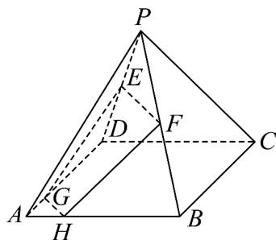

<!-- question-source:start -->
9. 如图，在正四棱锥 $P - ABCD$ 中，点 $E, F$ 分别为 $PD, PB$ 的中点，点 $G, H$ 分别为棱 $AD, AB$ 上的一点，

且 $DG = 3AG, BH = 3AH$

(1)若 $AB = 3\sqrt{2}, PA = 5$ ，求四棱锥 $P - ABCD$ 的体积；

(2)求证： $E,F,G,H$ 四点共面；

(3)求证：直线 $EG, FH, PA$ 三条直线交于一点.
<!-- question-source:end -->

![[高中/课堂同步/题库/人教A版高中数学同步讲义(2026)/02_必修第二册/第八章 立体几何初步/专题8.4 空间点、直线、平面之间的位置关系（高效培优讲义）/强化训练/questions/answers/Q00069824A1.md]]
