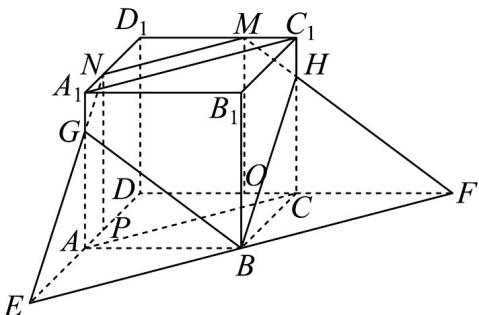

> [!faq]- 《专题8.4 空间点、直线、平面之间的位置关系（高效培优讲义）》官方解析
>
> > [!success]- **【答案】** 五 $40 + 8\sqrt{2}$
>
> > [!note]- **【分析】**
> > 过点 B 在平面 ABCD 内作 $EF \parallel AC$ ，分别交 DA，DC 的延长线于两点 E，F，连接 MF，NE 分别
> >
> > 交 $CC_{1}$ ， $AA_{1}$ 于H，G，连接各平面上的交点，即可得到平面BNM与正方体各表面的交线所围成多边形；通
> >
> > 过三角形相似以及勾股定理可以求出五边形各边边长，即可求出该多边形的周长·
>
> > [!note]- **【解析】**
> > 如图，连接MN， $A_{1}C_{1}$ ，AC，过点B在平面ABCD内作EF//AC，分别交DA，DC的延长线于E
> >
> > $F$ ，连接 $MF$ ， $NE$ 分别交 $CC_{1}$ ， $AA_{1}$ 于 $H$ ， $G$ ，连接 $GN$ ， $GB$ ， $BH$ ， $MH$ ，所以五边形 $NMHBG$ 为平面
> >
> > BNM 与正方体各表面的交线所围成多边形，过点 M 作 $MO \perp CD$ ，过点 N 作 $NP \perp AD$ ，所以 NP = MO = 12，
> >
> > 
> >
> > 由正方体 $ABCD - A_{1}B_{1}C_{1}D_{1}$ ，知 $A_{1}C_{1} // AC$ ，
> >
> > 因为 $D_{1}M = 8$ ， $D_{1}N = 8$ ，所以 $\frac{D_1M}{D_1C_1} = \frac{D_1N}{D_1A_1} = \frac{8}{12} = \frac{2}{3}$
> >
> > 所以 N 为 $D_{1}A_{1}$ 上靠近 $A_{1}$ 的三等分点，M 为 $D_{1}C_{1}$ 上靠近 $C_{1}$ 的三等分点，
> >
> > 所以 $A_{1}N = C_{1}M = 4$ ，因为 $\angle A_1D_1C_1 = 90^\circ$ ，所以根据勾股定理可得： $MN = 8\sqrt{2}$
> >
> > 因为 $AC // EF$ ， $AC$ 为对角线，所以 $\angle AEB = \angle DAC = 45^{\circ}$
> >
> > 又因为 $\angle EAB = 90^{\circ}$ ，所以 $\triangle EAB$ 为等腰直角三角形，所以 AB = AE = 12，
> >
> > 同理 $BC = CF = 12$ ，又因为 $GA \perp AD$ ， $NP \perp AD$ ，所以 $GA // NP$ ，
> >
> > 所以 $\triangle EAG$ 与 $\triangle EPN$ 相似，因为 $EP = EA + AP = 16$ ，所以 $\frac{GA}{NP} = \frac{EA}{EP} = \frac{12}{16} = \frac{3}{4}$
> >
> > 所以 $GA = 9$ ，同理VFCH与 $\triangle FOM$ 相似，所以 $CH = 9$
> >
> > 所以 $A_{1}G = C_{1}H = 3$ ，所以根据勾股定理可得： $NG = MH = 5$ ， $BG = BH = 15$
> >
> > 所以五边形 NMHBG 周长为 $NM + NG + BG + BH + MH = 40 + 8\sqrt{2}$
> >
> > 故答案为：五； $40+8\sqrt{2}$
